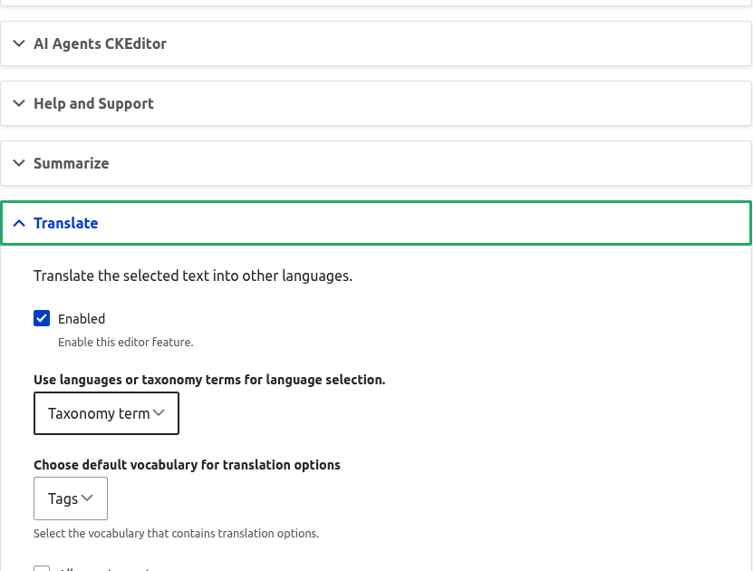

# Configuration

All configuration happens on the text format you want the AI tools to appear in. Nothing is global except the default prompts.

## Add the toolbar buttons

1. Go to `Administration > Configuration > Content authoring > Text formats and editors`.
2. Edit a format that uses CKEditor 5, for example Full HTML.
3. In the toolbar configuration, drag **AI Assistant** into the active toolbar. This is the dropdown that lists the AI actions.
4. Drag **AI Balloon Menu** into the active toolbar as well if you want the same actions to appear next to selected text.

## Configure the AI tools

Once the **AI Assistant** button is active, an **AI tools** section appears under the CKEditor 5 plugin settings. Each action has its own collapsible panel.

For each action you want to offer:

- **Enabled**: turn the action on for this format. Only enabled actions appear in the toolbar dropdown and the balloon menu.
- **AI provider**: pick the provider and model this action uses. Leave it on the default to use the AI module's default chat provider.
- **Prompt**: each action ships with a default prompt. Override it here if you want to change how the request is phrased. Prompts are stored as config entities under `ai.ai_prompt.*` and the chosen prompt id is saved in `ai_ckeditor.settings`.

### Translate options

The Translate action has extra settings:

- **Language source**: choose whether the language list comes from the site's configured languages or from a taxonomy vocabulary.
- **Vocabulary**: when the source is a taxonomy vocabulary, pick which one holds the language terms.
- **Allow autocreate**: let editors add new terms to the chosen vocabulary from the dialog.
- **Use term description for translation context**: pass the term description to the model as extra context for the translation.

### Tone options

The Tone action reads its tone list from a taxonomy vocabulary, with the same autocreate option. Configure the vocabulary in the action's panel.

## Dialog appearance

The module ships a set of dialog options (width, height, autoresize, CSS class) that control the modal the actions open in. These live in the `ckeditor5.plugin.ai_ckeditor_ai` settings and can be adjusted per format if the defaults do not fit your theme.

## Permissions

Grant **Use AI CKEditor plugin** to any role that should run the actions. This permission guards the `/api/ai-ckeditor/*` endpoints the plugins call. A user without it sees the buttons but gets no result.
