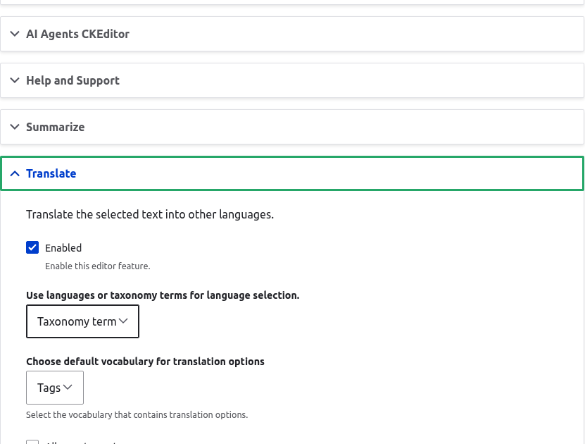

# Configuration

All configuration happens on the text format you want the AI tools to appear in. Nothing is global except the default prompts.

## Add the toolbar buttons

1. Go to `Administration > Configuration > Content authoring > Text formats and editors`.
2. Edit a format that uses CKEditor 5, for example Full HTML.
3. In the toolbar configuration, drag **AI Assistant** into the active toolbar. This is the dropdown that lists the AI actions.
4. Drag **AI Balloon Menu** into the active toolbar as well if you want the same actions to appear next to selected text.

### Add the buttons with a recipe

Recipes can add the buttons with the `addItemsToToolbar` config action. Unlike core's `editor:addItemToToolbar`, it accepts a list of items, so one action can add both buttons:

```yaml
config:
  actions:
    editor.editor.full_html:
      addItemsToToolbar:
        - aickeditor
        - ai_balloon_menu
```

Each list entry is either a toolbar item name or a map with the same options as `editor:addItemToToolbar` (`item_name`, `position`, `replace`, `allow_duplicate`). Items already in the toolbar are skipped, and the **AI Assistant** plugin gets its default settings so you can configure the actions afterwards.

[#3507570](https://www.drupal.org/i/3507570) adds the same action to Drupal core as `editor:addItemsToToolbar`. Until it lands, ai_ckeditor registers its own implementation under that ID; on core versions that already provide the action, ai_ckeditor stays out of the way and the core implementation is used. Recipes work unchanged either way.

### Configure the AI Assistant actions in a recipe

The config action only adds the buttons; every AI action starts disabled. The **AI Assistant** settings live in the editor config under `settings.plugins.ai_ckeditor_ai`, so a recipe can enable and configure individual actions in the same step, for example with a `simpleConfigUpdate` action:

```yaml
config:
  actions:
    editor.editor.full_html:
      addItemsToToolbar:
        - aickeditor
        - ai_balloon_menu
      simpleConfigUpdate:
        settings.plugins.ai_ckeditor_ai:
          dialog:
            autoresize: 'min-width: 600px'
            height: '750'
            width: '900'
            dialog_class: ai-ckeditor-modal
          plugins:
            ai_ckeditor_completion:
              enabled: true
              provider: ''
            ai_ckeditor_spellfix:
              enabled: true
              provider: openai__gpt-4o
            ai_ckeditor_translate:
              enabled: true
              provider: ''
              language_source: lang
              autocreate: false
              translate_vocabulary: ''
              use_description: false
```

Each action is keyed by its plugin ID: `ai_ckeditor_completion`, `ai_ckeditor_help`, `ai_ckeditor_modify_prompt`, `ai_ckeditor_reformat_html`, `ai_ckeditor_spellfix`, `ai_ckeditor_summarize`, `ai_ckeditor_tone`, and `ai_ckeditor_translate`. All of them take `enabled` and `provider`, where `provider` uses the AI module's `<provider>__<model>` format (for example `openai__gpt-4o`) and an empty string means the site's default chat provider. Translate additionally takes `language_source` (`lang` for site languages or `tax` for a vocabulary), `translate_vocabulary`, `autocreate`, and `use_description`; Tone takes `tone_vocabulary`, `autocreate`, and `use_description`. See `config/schema/ai_ckeditor.schema.yml` for the full reference.

The same structure applies if you ship a complete `editor.editor.*.yml` file in your recipe's `config` directory instead of using config actions.

## Configure the AI tools

Once the **AI Assistant** button is active, an **AI tools** section appears under the CKEditor 5 plugin settings. Each action has its own collapsible panel.



For each action you want to offer:

- **Enabled**: turn the action on for this format. Only enabled actions appear in the toolbar dropdown and the balloon menu.
- **AI provider**: pick the provider and model this action uses. Leave it on the default to use the AI module's default chat provider.
- **Prompt**: each action ships with a default prompt. Override it here if you want to change how the request is phrased. Prompts are stored as config entities under `ai.ai_prompt.*` and the chosen prompt id is saved in `ai_ckeditor.settings`.

### Translate options

The Translate action has extra settings:

- **Language source**: choose whether the language list comes from the site's configured languages or from a taxonomy vocabulary.
- **Vocabulary**: when the source is a taxonomy vocabulary, pick which one holds the language terms.
- **Allow autocreate**: let editors add new terms to the chosen vocabulary from the dialog.
- **Use term description for translation context**: pass the term description to the model as extra context for the translation.

### Tone options

The Tone action reads its tone list from a taxonomy vocabulary, with the same autocreate option. Configure the vocabulary in the action's panel.

## Dialog appearance

The module ships a set of dialog options (width, height, autoresize, CSS class) that control the modal the actions open in. These live in the `ckeditor5.plugin.ai_ckeditor_ai` settings and can be adjusted per format if the defaults do not fit your theme.

## Permissions

Grant **Use AI CKEditor plugin** to any role that should run the actions. This permission guards the `/api/ai-ckeditor/*` endpoints the plugins call. A user without it sees the buttons but gets no result.
