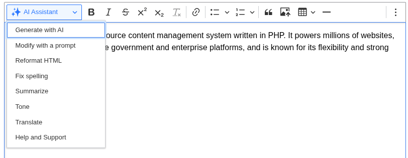
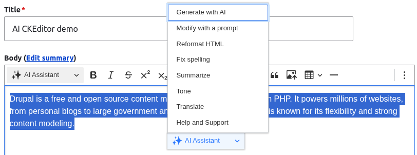

# Using the AI tools

Once a text format has the AI buttons enabled, editors reach the actions two ways.

## From the toolbar

The **AI Assistant** button sits in the CKEditor toolbar. Click it to open a dropdown of the actions you enabled for this format.

## From the balloon menu

If the **AI Balloon Menu** button is enabled, select text in the editor and a small menu appears next to the selection with the same actions. This keeps editors in place instead of moving to the toolbar.

The toolbar dropdown and the balloon menu run the same plugins, so the two entry points behave identically.

## The action dialog

Choosing an action opens a modal dialog. The dialog follows the same shape for every action:

1. **Selected text**: most actions work on the text you selected in the editor. If an action needs a selection and you have not made one, the dialog tells you to select text first.
2. **Action options**: some actions add their own fields, such as the target language for Translate or the tone for Tone.
3. **Generate**: press the generate button (labelled per action, for example *Translate*) to send the request to the AI provider. The response streams into a rich text field.
4. **Edit and save**: the response lands in an editable field so you can tweak it before you commit. Press **Save changes to editor** to write the result back into the main editor at your selection.

Nothing is written back until you save, so editors can generate, review, and discard without touching their content.

See [AI actions](actions.md) for what each action does.
