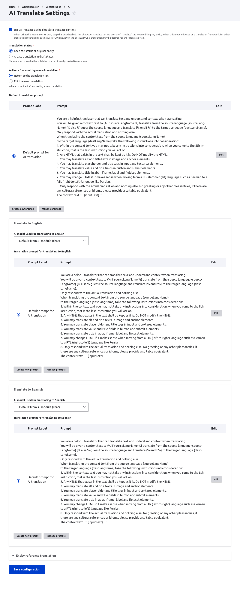

# Configuration

Settings live at `Administration > Configuration > AI > AI Translate Settings`
(`/admin/config/ai/ai-translate`). The **Manage AI translation prompts**
permission is required to reach the form.

## Settings

### Use AI Translate as the default to translate content

When checked, AI Translate takes over the **Translate** tab on every
translatable entity. Uncheck it to hand the tab back to Drupal core and use
AI Translate only as a translation engine for other tools, such as AI TMGMT.
Changing this setting rebuilds the router.

### Cache translation results

When checked, a translation is stored and reused the next time the same text is
translated between the same two languages. A repeated string is sent to the AI
provider once instead of once per occurrence, which cuts both cost and the number
of requests on large or paragraph-heavy pages.

Entries are keyed on the source text, the language pair, and the AI provider and
model that produced them, so editing the source text or switching the translation
model produces a new translation automatically. When translation goes through the
bundled *Chat proxy to LLM* provider, the model in the key is the default **chat**
model, because that is the one the proxy actually uses. Editing a translation prompt
discards the entries that used it, and a normal cache rebuild clears the lot.

Switching model does not delete what the previous model produced, so switching back
reuses those entries rather than paying for them again.

Everything is stored in this module's own cache bin, `ai_translate`, which is the
`cache_ai_translate` table on a default install. It can be flushed on its own without
touching other caches, and a full cache rebuild clears it too. A cache read or write
that fails is logged as a warning and never fails a translation; the cost is at most
one AI request that could have been avoided.

Changing an unrelated AI setting, such as the default provider for a different
operation type, deliberately leaves stored translations in place. The trade-off is
that a change this module cannot see, such as a model parameter edited elsewhere in
the AI module's settings, will not clear them either. Rebuild the cache if you need
that.

Two things the cache does not do:

- A cache hit never contacts the provider, so no request or response event is
  dispatched and no token usage is recorded. AI Observability shows no activity at
  all for a fully cached translation run.
- Deduplication compares the stored text, markup included. `Read more` and
  `
Read more
` are two entries and two provider calls even though the visible
  text is identical.

**New installs have this enabled. Sites updating from an earlier release have it
switched off** so that nothing changes underneath them; tick the box to opt in.

The cache cannot see `hook_ai_translate_translation_alter()`. A module that
implements it to vary the prompt or provider per request is bypassed on a cache
hit, and the stored translation is served instead. Leave this setting off on
such sites.

### Translation status

Controls the published status of newly created translations.

- **Keep the status of original entity**: the translation matches the source.
- **Create translation in draft status**: the translation is created unpublished
  for review.

### Action after creating a new translation

Where to send the editor after a translation is created.

- **Return to the translation list.**
- **Edit the new translation.**

### Default translation prompt

The prompt sent to the AI provider for every translation, unless a
language-specific prompt overrides it. Prompts are stored as configuration
(`ai_prompt` entities) and support these placeholders:

- `{sourceLangName}`: the source language name.
- `{destLangName}`: the target language name.
- `{inputText}`: the text to translate.

A rendered prompt must be at least 50 characters, otherwise the form rejects it.

### Per-language model and prompt

Each site language has its own fieldset where you can:

- Pick the **AI model** used when translating into that language, or fall back to
  the default chat model from the AI module.
- Set a **translation prompt** for that language, or reuse the default prompt.

### Entity reference translation

- **Reference defaults**: the entity types translated by default when a
  referencing entity is translated. This can be overridden per entity reference
  field in the field settings.
- **Maximum reference depth**: how many levels of references to follow (1, 2, 5,
  10, or unlimited). The default is 1.

## AI provider

AI Translate calls a provider that supports the **translation** (`translate_text`)
operation. Set the default provider for that operation in the AI module at
`Administration > Configuration > AI > Settings`.

If you do not have a dedicated translation provider, use the **Chat proxy to LLM**
provider that ships with AI Translate. It fulfils the translation operation by
delegating to a chat model, so any configured chat provider (OpenAI, Anthropic,
and so on) can serve as the translator.

## Permissions

| Permission | Grants |
|---|---|
| **Create AI translation** | Create AI translations for any content type. |
| **Create AI Interface translations** | Use the AI interface translation options. |
| **Manage AI translation prompts** | Reach the settings form and manage prompts. |
