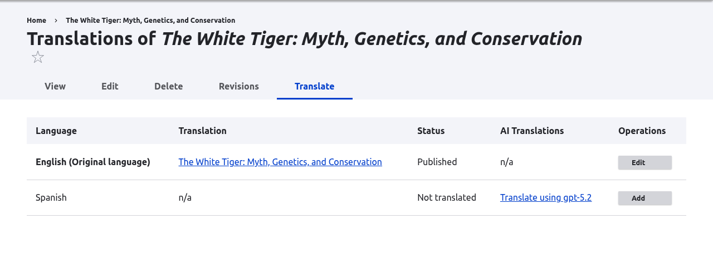

# AI Translate

AI Translate adds one-click, AI-powered translations to Drupal's content
translation system. It takes over the **Translate** tab on any translatable
entity and sends the content to a configured AI provider, which returns a
translation in the target language.

## Features

- **One-click translation.** Generate a translation straight from the Translate
  tab, no copy and paste between an external tool and the edit form.
- **Field-aware extraction.** Pulls translatable text from plain and formatted
  text fields, summaries, link titles, image alt text, and file descriptions,
  then writes the result back to the right places.
- **Translation caching.** Reuses a previous translation when the same text is
  translated again, so repeated strings cost one AI request instead of many.
  Enabled for new installs; existing sites opt in.
- **Referenced content.** Follows entity reference fields and translates the
  entities they point to, up to a reference depth you set (or unlimited).
- **Per-language control.** Choose a different AI model and translation prompt
  for each target language, or fall back to the site default.
- **Editable prompts.** The translation prompt is stored as configuration, so
  you can tune tone and terminology without touching code.
- **Publishing status.** Keep the status of the original entity, or create every
  new translation as a draft for review.
- **Interface translation.** Translate UI strings through the same AI provider.
- **Drush support.** Trigger translations from the command line.
- **Framework mode.** Hand the Translate tab back to Drupal and use AI Translate
  as the translation engine behind other tools, such as AI TMGMT.

## Where it came from

AI Translate shipped as a submodule of the [AI](https://www.drupal.org/project/ai)
module until AI 1.3.0, which deprecated it in favor of this standalone project.
The deprecated submodule is still present in the AI 1.x releases and is removed
in AI 2.0.0, so sites on AI 1.x should move to this project before upgrading. See
[Installation](installation.md) and the change record
[Moving AI Translate Module out of AI project](https://www.drupal.org/node/3570275).

## Next steps

- [Installation](installation.md)
- [Configuration](configuration.md)
- [Translating content](usage/translating-content.md)
