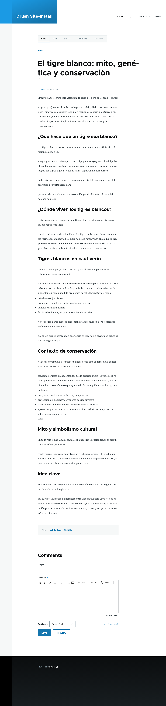

# Translating content

With the module enabled and a target language set up, open any translatable
entity and go to its **Translate** tab. AI Translate adds an **AI Translations**
column to the overview, with a one-click action for each language that has no
translation yet.

## Create a translation

1. Open the entity's **Translate** tab (for a node, `/node/{id}/translations`).
2. In the **AI Translations** column, select **Translate using &lt;model&gt;** for
   the target language.
3. AI Translate extracts the translatable text, sends it to the AI provider, and
   writes the returned text back into a new translation. The work runs in a batch,
   so large entities with many referenced items report progress as they go.
4. When the batch finishes, you land on the translation list or the new
   translation's edit form, depending on the **Action after creating a new
   translation** setting.

The result is a complete translation of the entity, with the title, section
headings, and body all rendered in the target language.

## What gets translated

AI Translate walks the entity's translatable fields and extracts text from:

- Plain and formatted text fields, including the title.
- Text fields with a summary.
- Link field titles.
- Image alt and title text.
- File descriptions.
- Referenced entities, followed up to the configured
  [reference depth](../configuration.md#entity-reference-translation).

Field types are handled by [field text extractor
plugins](../developers/field-text-extractors.md). Modules can add extractors for
their own field types.

## Referenced entities

When an entity references other entities (paragraphs, media, or nodes, for
example), AI Translate can translate those too. Control this with the
**Reference defaults** and **Maximum reference depth**
[settings](../configuration.md#entity-reference-translation), or override the
default per entity reference field in that field's settings.

## Publishing status

New translations follow the **Translation status**
[setting](../configuration.md#translation-status): they either match the source
entity's status or are created as drafts for review.
