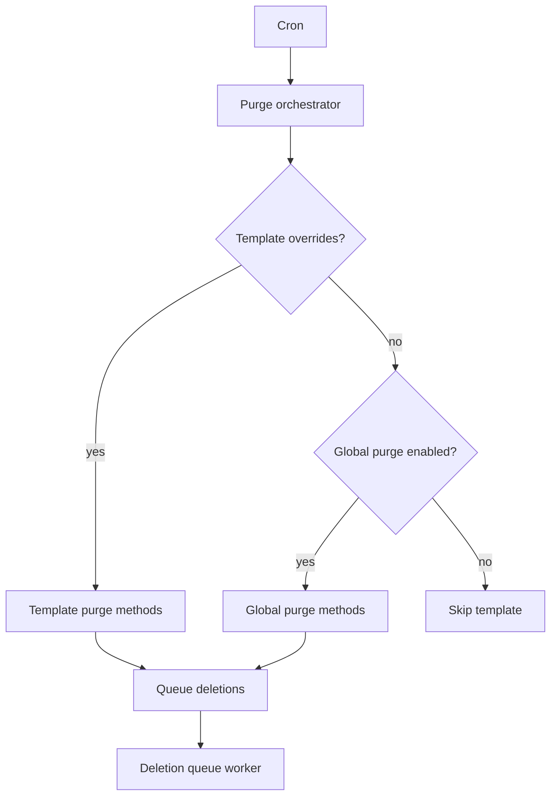

# Purging and cleanup

Message can delete old or excess messages on cron so activity tables do not grow
without bound.

## Global purge

At **Configuration → Message → Message settings**
(`/admin/config/message/message`):

1. Enable **Purge messages**.
2. Configure one or both built-in methods:

| Method | Effect |
|--------|--------|
| **Quota** | Keep an approximate maximum number of messages per template (newest retained) |
| **Days** | Delete messages older than the configured number of days |

Global purge runs for every template that does **not** override purge settings.

## Per-template override

On a template edit form, enable **Override global settings** to ignore the
global purge configuration for that template. Then configure purge methods for
that template alone.

- If a template overrides globals but has **no** purge methods enabled, its
  messages are not purged by cron.
- If a template does not override globals, it follows the global enable flag and
  methods.

## How purge runs

On cron, Message loads each template, resolves the applicable purge methods, and
queues message IDs for deletion in chunks. Queue workers perform the actual
deletes.

## Cascade delete on entity delete

Separately from cron purge, Message can delete messages when a referenced entity
is deleted. Configure entity types under the same settings form. See
[Installing and configuring](install-configure.md).
