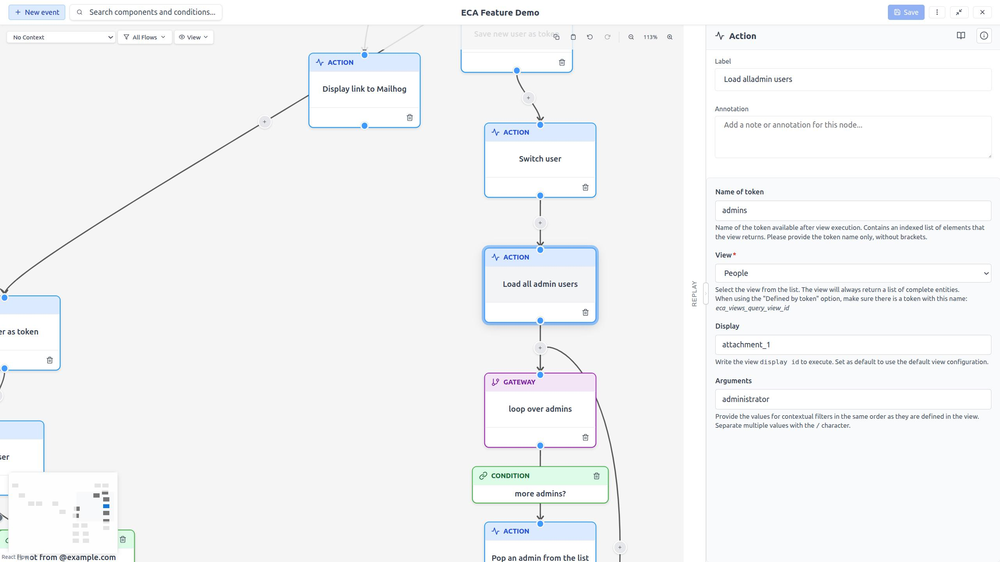

# Configuration Forms

Every workflow component can have a **configuration form** -- a set of fields
that control its behavior. Configuration forms are generated dynamically by
the backend based on the component's plugin.

## Opening the configuration form

1. Click a node or edge on the canvas to select it.
2. The Property Panel opens on the right.
3. The configuration form appears below the label and annotation fields.

{ .screenshot }

## Field types

Configuration forms can include the following field types:

| Field Type | Description |
|------------|-------------|
| **Text field** | Single-line text input. |
| **Text area** | Multi-line text input. |
| **Select list** | Dropdown with predefined options. |
| **Checkbox** | Boolean on/off toggle. |
| **Number** | Numeric input with optional min/max/step constraints. |
| **Markup** | Read-only informational text (not editable). |

## Required fields

Some fields are marked as **required**. You should fill these in before saving
your model. Required fields are indicated by the field's label or styling.

## Token support

Some configuration fields accept **tokens** -- placeholders for dynamic values
that are resolved during workflow execution (e.g., `[node:title]` for the
title of the current entity).

### How to use tokens

1. Load replay data or run a test to see available tokens in the Replay Panel.
2. Look for token values in the **Step Data** or **Global Tokens** sections.
3. Drag a token from the Replay Panel directly into a token-enabled
   configuration field.

### Visual indicators

During a token drag:

- **Eligible fields**: Glow with a border highlight to show they accept the
  token.
- **Non-eligible fields**: Dim to indicate they do not accept tokens.

### The "Replace tokens" checkbox

Some forms include a **Replace tokens** checkbox. When enabled, it makes
**all** fields in the form accept token drops, regardless of their individual
token support setting.

### Inline token editing

After dropping a token into a field, it appears as a styled pill (e.g.,
`[node:title]`). You can:

- **Edit**: Hover over the token and click the pencil icon, or press
  `Ctrl+E` / `Cmd+E` to open an inline editor.
- **Move**: Drag the token pill to reposition it within the same field.
- **Delete**: Select the token and press Delete or Backspace.

See [Tokens & Data](../replay/tokens.md) for the full token workflow.

## Structured YAML editing

Some textarea fields store structured data as YAML (e.g., event arguments,
HTTP headers). When the backend provides a **YAML schema** for such a field,
the modeler renders a **structured editor** instead of a plain textarea.

### How it works

The structured editor presents granular, type-aware inputs for each property
defined in the schema:

| Schema type | Input rendered |
|-------------|----------------|
| `string` | Text input (or dropdown when options are defined) |
| `number` | Numeric input with optional min/max/step |
| `boolean` | Checkbox |
| `list` | Ordered list with add/remove controls |
| `mapping` | Named property group rendered as a fieldset |
| `keyed_mapping` | Dynamic entries with user-defined keys and structured values |

Schemas support arbitrary nesting -- a mapping can contain lists of mappings,
and so on.

### Editor / YAML toggle

Each YAML field has a toolbar with **Editor** and **YAML** buttons:

- **Editor mode** (default): Shows the structured form.
- **YAML mode**: Shows the raw YAML text for manual editing.

Changes in either mode are synchronized. If the raw YAML contains a syntax
error, a warning is shown and the structured editor preserves the last valid
state.

### Schema validation in YAML mode

When editing in **YAML mode**, the editor automatically validates the parsed
data against the schema and displays any mismatches as warnings. This gives
immediate feedback while typing raw YAML without blocking edits.

Detected issues include:

- **Type mismatches** -- e.g., a string where a number is expected.
- **Missing required fields** -- required properties that are absent or empty.
- **Unexpected properties** -- keys not declared in the schema.
- **Constraint violations** -- numbers outside the declared min/max range, or
  string values that are not in the allowed options.

Each warning shows the **path** to the offending value (e.g., `host`,
`endpoints[0].path`) and a human-readable message. A count is displayed in
the warning header.

!!! note
    Validation warnings only appear in YAML mode. In Editor mode, the
    structured form inherently prevents most schema violations through
    type-appropriate input widgets. Switching back to Editor mode clears
    any displayed warnings.

### Schema discovery

YAML schemas are discovered automatically from Drupal's config schema system.
No special form properties are needed. The convention is:

> For a plugin with config schema key `{SCHEMA_KEY}` and a textarea field
> `{FIELD_KEY}`, if a config schema definition exists at
> `yaml.{SCHEMA_KEY}.{FIELD_KEY}`, that schema is used.

The backend converts the Drupal config schema definition to the editor's JSON
format and sends it inline on the form field. No additional HTTP requests are
needed.

## Form loading

When you select a component, the configuration form is loaded from the backend
via an API call. A loading indicator appears while the form is being fetched.
If the component has no configurable settings, no form is displayed.

## Validation

Form validation is handled at two levels:

- **Client-side (YAML fields)**: When a YAML field is in YAML mode,
  real-time schema validation checks the data structure and types as you
  type. Warnings are displayed inline but do not prevent editing. See
  [Schema validation in YAML mode](#schema-validation-in-yaml-mode) above.
- **Server-side**: When the model is saved, the backend validates all form
  fields. If validation errors occur, they are displayed as messages in
  the toolbar area.
