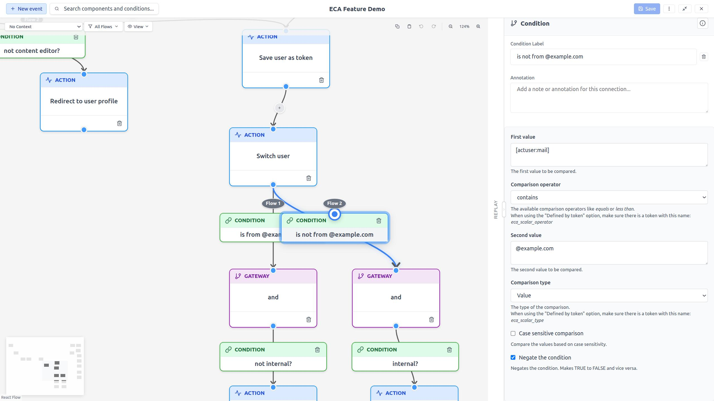

# Edges & Conditions

Edges are the connections between nodes. They define the flow of execution
through your workflow and can optionally carry conditions.

## Creating edges

### Manual connection

1. Hover over the source node to reveal its **output port** (a small circle).
2. Click the output port and drag to the target node's **input port**.
3. Release to create the edge.

### Automatic connection (quick-add)

When you add a node via the quick-add **+** button, an edge is automatically
created connecting the source node to the new node.

### Condition-first connection

You can also create a conditional edge by selecting a **condition** from a
node's quick-add popup. This creates both an edge (with the condition
pre-attached) and a [placeholder node](nodes.md#placeholder-nodes) as the
target. Replace the placeholder with a real action or gateway afterwards.

## Edge types

### Simple edges

A direct connection from one node to another with no condition. Execution
always flows through a simple edge.

### Conditional edges

Edges can have a **condition** attached. Conditions evaluate to true or false
during execution:

- If the condition passes, execution continues to the target node.
- If the condition fails, execution does not follow that edge.

Conditional edges display the condition name as a label on the edge.

### Annotations on edges

Any edge (simple or conditional) can have an **annotation** -- a documentation
note stored as part of the edge data.

## Adding a condition to an edge

1. Hover over an edge to reveal the **+** (quick-add condition) button.
2. Click the button to open a popup with available conditions.
3. Select a condition. It is attached to the edge.

{ .screenshot }

Alternatively, select an edge by clicking on it and configure the condition
in the Property Panel.

!!! tip "Condition-first authoring"
    You can also add a condition **before** choosing the target action. Use the
    **+** button on a node and select a condition from the popup. See
    [Nodes > Quick-add successor](nodes.md#quick-add-successor) for details.

## Configuring edges

Click an edge to select it. The Property Panel shows:

- **Label**: The edge's display label (editable inline).
- **Condition**: The attached condition plugin and its configuration form.
- **Annotation**: An optional documentation note.

## Edge order

When a node has multiple outgoing edges, the order matters -- it determines
the sequence in which conditions are evaluated. Each edge displays a
**"Flow N"** badge (e.g., "Flow 1", "Flow 2") showing its position.

### Changing edge order

There are two ways to reorder edges:

- **Click the badge**: Click a "Flow N" badge to open a dropdown listing all
  available positions. Select a different position to swap. The dropdown
  supports keyboard navigation (Enter/Space to toggle, Escape to close).
- **Drag the badge**: Drag a flow badge and drop it on another badge to swap
  positions.

## Deleting edges

Select an edge and press `Delete`. This removes the connection but leaves
both nodes in place.

If a condition is attached, it is also removed with the edge.

## Visual indicators during replay

During execution replay, edges show visual indicators:

- **Green checkmark**: The condition passed and execution flowed through.
- **Red X**: The condition failed and execution did not follow this edge.

See [Replay & Testing](../replay/index.md) for more details.
