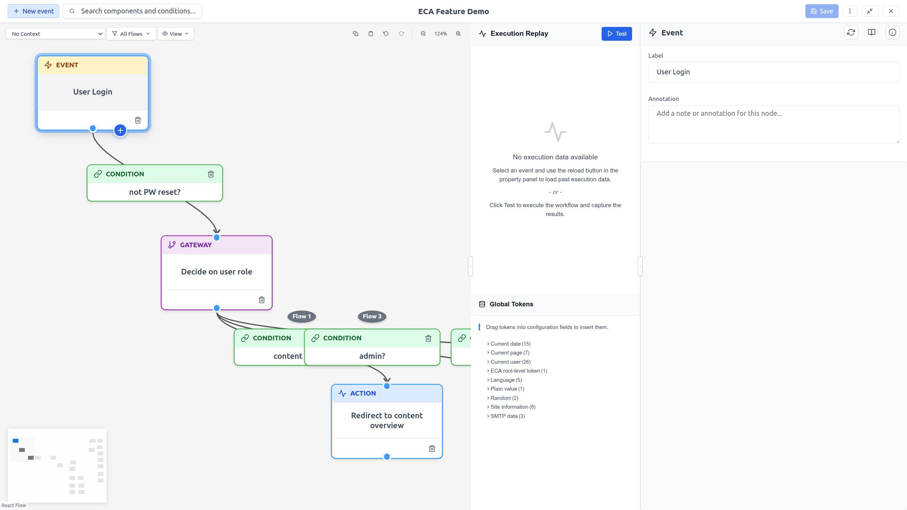

# Nodes

Nodes are the visual elements on the canvas that represent workflow components.
Each node has a type, a label, and optional configuration.

## Node types

### Event nodes (start)

Event nodes are the **entry points** of a workflow. They define what triggers
the workflow to execute.

- **Visual style**: Rounded rectangle with a distinct color.
- **Examples**: "Entity is created", "Cron runs", "Form is submitted".
- **Behavior**: A workflow can have multiple event nodes, creating separate
  flows on the same canvas.

{ .screenshot }

### Element nodes (actions)

Element nodes represent **actions** -- tasks that the workflow performs when
executed.

- **Visual style**: Standard rectangle.
- **Examples**: "Send email", "Set field value", "Create entity".
- **Behavior**: Actions execute in the order defined by the edges connecting
  them.

### Gateway nodes

Gateways are **decision points** that control how the workflow branches. They
evaluate conditions and route execution accordingly.

- **Visual style**: Diamond shape.
- **Behavior**: Gateways can split a single flow into multiple paths or merge
  multiple paths back together.

### Subprocess nodes

Subprocess nodes **reference other workflow models**, allowing you to reuse
existing workflows as building blocks.

- **Visual style**: Double-bordered rectangle.
- **Behavior**: When execution reaches a subprocess node, the referenced
  workflow is invoked.

### Placeholder nodes

Placeholder nodes are **temporary** nodes created during condition-first
authoring. When you select a condition from a node's quick-add popup (instead
of an action), the modeler creates a placeholder node connected by the
condition edge.

- **Visual style**: Dashed amber border with a striped background and a
  pulsing "Select action..." button.
- **Behavior**: Placeholder nodes must be replaced with a real action or
  gateway before the model can be saved, tested, or closed. Click the
  "Select action..." button to choose the component that should replace it.

!!! warning
    A model containing placeholder nodes cannot be saved. The Save, Test,
    and Close buttons will display an error message until all placeholders
    are resolved.

## Common operations

### Selecting a node

Click on a node to select it. The Property Panel opens with the node's
configuration.

### Moving a node

Click and drag a node to reposition it. Nodes snap to a 20px grid.

### Configuring a node

With a node selected, use the Property Panel to:

1. Edit the **label** (click the label text).
2. Fill in the **configuration form** fields.
3. Add an **annotation** note for documentation.

### Deleting a node

Select a node and press `Delete`, or use the delete option in the Property
Panel. Deleting a node also removes all edges connected to it.

## Quick-add successor

Hover over any node to reveal a **+** button. Click it to open a popup with
components that can follow this node. The popup shows actions, gateways, and
conditions:

- **Actions and gateways**: Selecting one creates a new node and connects it
  to the source node.
- **Conditions** (condition-first authoring): Selecting a condition creates a
  placeholder node as the successor, with the condition pre-attached to the
  connecting edge. The condition edge is automatically selected so you can
  configure it immediately. See [Placeholder nodes](#placeholder-nodes) above.

### Type filter

The popup includes a collapsible **Filter** panel that lets you narrow the
component list by type:

- **All** (default): Shows actions, conditions, and gateways.
- **Actions**: Shows only action components.
- **Conditions**: Shows only condition components.
- **Gateways**: Shows only gateway components.

Click the "Filter" toggle to expand or collapse the panel. An active filter
is indicated by a badge on the toggle button.

### Additional filtering

The quick-add popup also respects:

- **Context filtering**: Only shows components valid for the selected context.
- **Dependency rules**: Hides components that require predecessor types not
  present in the workflow.
- **Search threshold**: When fewer than 15 components are available, the search
  field is hidden for simplicity.
