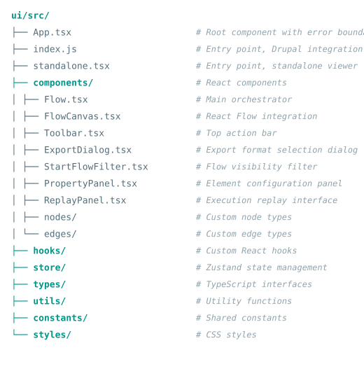

# Architecture

The modeler's React application follows established architectural patterns for
maintainability, testability, and performance. For the complete reference, see
`ui/docs/architecture-patterns.md`.

## Application structure

## Key patterns

### Orchestrator pattern

`Flow.tsx` acts as the central orchestrator, coordinating between all panels
and managing the data flow. It:

- Initializes the model from `drupalSettings`.
- Manages modal state and confirmation dialogs.
- Wires up event handlers between panels.
- Coordinates replay/test workflows.

Individual components remain focused on rendering and user interaction.

### Drupal integration

The modeler integrates with Drupal through `drupalSettings`:

- **Model data**: JSON model loaded from `drupalSettings.modeler.modelData`.
- **Components**: Available plugins from `drupalSettings.modeler.components`.
- **API endpoints**: Save, config form, replay, test, export, and recipe URLs
  from `drupalSettings.modeler_api`.
- **Permissions**: Granular permissions from `drupalSettings.modeler_api.permissions`.
- **Dependencies**: Component dependency rules from `drupalSettings.modeler_api.dependencies`.
- **Component labels**: Model-owner-specific terminology from `drupalSettings.modeler_api.component_labels`.
- **CSRF tokens**: Fetched from Drupal's token endpoint for secure API calls.
- **Messages**: Drupal's `Drupal.Message` API is bridged into the modeler's UI.

### Plugin system

The modeler exposes a JavaScript Plugin API via the global
`window.WorkflowModeler` object. Other Drupal modules can register **toolbar
widgets** (buttons, toggles) and **panels** (sidebar/bottom content areas) that
interact with the modeler's state through a public API. The API provides
deep-cloned snapshots for reading state, event subscriptions for reacting to
changes, and mutation methods for adding, updating, and removing nodes and edges
(with automatic undo/redo and unsaved-changes integration).

Plugin registrations are framework-agnostic (plain DOM) and survive HTMX
re-mount cycles. Panels are wrapped in error boundaries so a crash in a plugin
cannot take down the modeler. When the React app has mounted and the API is
available, a **`workflow-modeler:ready`** custom event is dispatched on
`document`, allowing external Drupal behaviors to safely register their widgets
and panels at the right time. See [Plugin API](plugin-api.md) for full
documentation.

### Standalone mode

The modeler can also run without Drupal via `standalone.tsx`. In this mode,
model data comes from a JSON file (exported via the JSON export format) and
the modeler operates in read-only mode. See
[Standalone Viewer](../features/standalone-viewer.md).

See `ui/docs/integration.md` for the complete integration reference.

### Error boundary hierarchy

The application uses a layered error boundary approach:

- **App-level boundary**: Catches fatal errors and offers retry.
- **Panel-level boundaries**: Individual panels have `PanelErrorBoundary`
  components that can auto-retry without crashing the entire application.

### CSS architecture

All styles are scoped to the `.modeler` class with `all: revert` to prevent
Drupal admin theme styles from leaking in. The modeler uses approximately 98
CSS custom properties for consistent theming:

- **Colors**: `--modeler-color-*`
- **Typography**: `--modeler-font-*`
- **Spacing**: `--modeler-radius-*`
- **Dark mode**: Overridden in `.modeler.dark-mode` blocks.

#### Host-page CSS encapsulation

The `all: revert` on `.modeler` only affects the root element itself -- it does
not cascade to descendants. Host-page rules (e.g., mkdocs-material's
`.md-typeset svg { height: auto }` or `.md-typeset h1 { font-size: 2em }`) can
still interfere with elements inside the modeler.

To handle this, targeted reset rules at the top of `modeler.css` revert the
most commonly affected elements (SVG icons, headings, images) back to browser
defaults. These resets use `:where()` to keep specificity low and `:not()`
guards to avoid overriding ReactFlow's own CSS.

See `ui/docs/code-quality.md` for the complete CSS variable reference and
encapsulation details.
