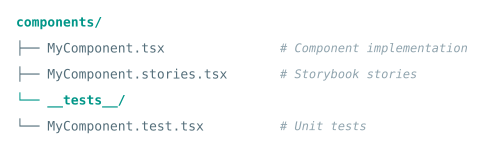

# Component Development

This page covers the patterns and conventions for creating new React components
in the modeler. For the complete reference, see `ui/docs/component-development.md`.

## File structure

Every component follows a consistent file structure:



## Component template

```typescript
import React from 'react';
import { useGraphStore } from '../store/useGraphStore';
import { t } from '../utils/translation';

interface MyComponentProps {
  title: string;
  onAction?: () => void;
}

const MyComponent: React.FC<MyComponentProps> = ({ title, onAction }) => {
  const someState = useStore(state => state.someValue);

  return (
    <div className="my-component" data-testid="my-component">
      <h3>{t(title)}</h3>
      {onAction && (
        <button onClick={onAction} aria-label={t('Perform action')}>
          {t('Action')}
        </button>
      )}
    </div>
  );
};

export default MyComponent;
```

## Checklist for new components

- [ ] TypeScript interfaces for all props.
- [ ] All user-facing strings wrapped in `t()`.
- [ ] CSS uses `--modeler-*` custom properties (no hardcoded colors).
- [ ] `data-testid` attributes for E2E testing.
- [ ] `aria-label` and other ARIA attributes for accessibility.
- [ ] Storybook stories covering all variants.
- [ ] Unit tests with React Testing Library.
- [ ] Error and loading states handled.
- [ ] Works in both light and dark mode.

## Storybook

Every component should have Storybook stories for visual documentation and
accessibility testing. Stories are automatically tested with axe-core in both
light and dark mode.

```typescript
import type { Meta, StoryObj } from '@storybook/react';
import MyComponent from './MyComponent';

const meta: Meta<typeof MyComponent> = {
  title: 'Components/MyComponent',
  component: MyComponent,
};

export default meta;
type Story = StoryObj<typeof MyComponent>;

export const Default: Story = {
  args: {
    title: 'Sample Title',
  },
};
```

See `ui/docs/component-development.md` for advanced patterns including
compound components, render props, and error boundaries.
