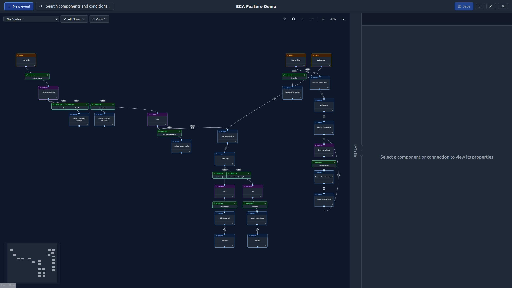

# Dark Mode

The modeler supports a **dark theme** for comfortable editing in low-light
environments.

## Toggling dark mode

Click the **moon/sun icon** in the toolbar to switch between light and dark
themes:

- **Moon icon**: Currently in light mode; click to switch to dark.
- **Sun icon**: Currently in dark mode; click to switch to light.

{ .screenshot }

## Persistence

Your dark mode preference is saved to the browser's **local storage** and
persists across sessions and page reloads. Each browser maintains its own
preference.

## Accessibility

Both light and dark themes meet **WCAG AA contrast requirements**:

- Text contrast: minimum 4.5:1 ratio.
- Non-text elements (icons, borders): minimum 3:1 ratio.

The dark theme uses carefully chosen colors to ensure readability while
reducing eye strain.

## Reduced motion

If your operating system is set to **prefer reduced motion**, all animations
and transitions in both themes are minimized. This includes the search
highlight animation, panel transitions, and loading indicators.
