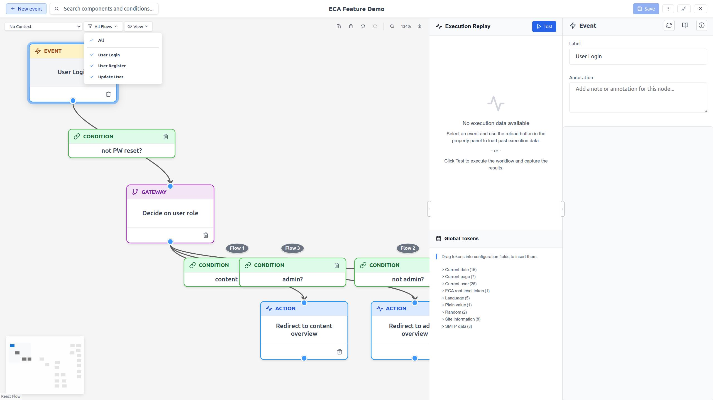

# Flow Filtering

When a model contains **multiple event (start) nodes**, each event and its
connected components form a separate "flow". Flow filtering lets you show
only the flows you are interested in, hiding the rest.

## When flow filtering appears

The **Start Flow Filter** dropdown appears automatically in the toolbar when
your model has **two or more event nodes**. If the model has only one event,
the filter is not shown.

## Using the filter

1. Click the **flow filter dropdown** in the toolbar.
2. Select or deselect event nodes to control which flows are visible.
3. Only the selected flows and their connected nodes remain visible on the
   canvas. Unselected flows are hidden.

{ .screenshot }

## How it works

The filter uses a breadth-first search starting from each selected event node,
following edges to find all reachable nodes. Nodes that are not reachable from
any selected event are hidden using React Flow's `hidden` property.

## Automatic behavior

- **New event nodes**: When you add a new event node, it is automatically
  included in the active filter selection.
- **Auto-selection on load**: If the model is opened with a specific component
  pre-selected (via URL parameter), and that component is an event node, the
  filter is pre-set to show only that event's flow.

## Tips

- Flow filtering is useful for large models with many independent workflows
  on the same canvas.
- Use it to focus on one workflow at a time during editing or review.
- The filter does not delete or modify any elements -- it only controls
  visibility.
