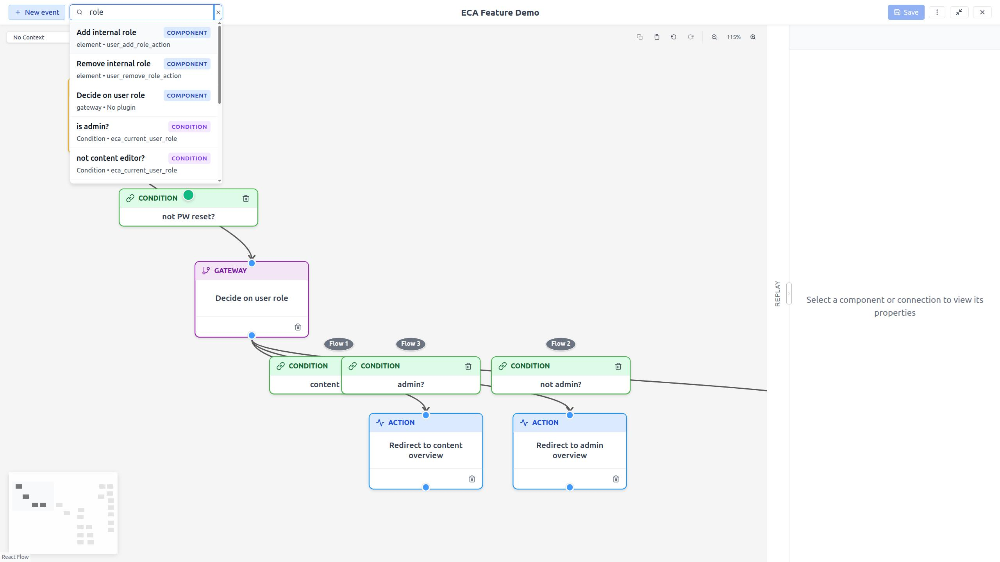

# Search & Find

The modeler includes a built-in search function that helps you locate nodes and
edges in large workflows.

## Opening the search bar

- Click the **search icon** in the toolbar.
- Or press `Ctrl+F` (`Cmd+F` on Mac).

The search bar appears inline in the toolbar.

{ .screenshot }

## Searching

Type in the search field to find elements. The search matches against:

- **Label**: The display name of the node or edge.
- **Plugin ID**: The technical plugin identifier.
- **Type**: The node type (event, action, gateway, subprocess).
- **Component ID**: The internal element ID.

Results are filtered in real-time as you type.

## Viewing results

Matching results appear in a **dropdown list** below the search bar. Each
result shows the element's label and type.

### Keyboard navigation

Use the arrow keys to navigate through results in the dropdown, and `Enter`
to select a result.

## Visual highlighting

When you select a search result, the matching element is highlighted on the
canvas with an **orange glow and pulsing animation**. The canvas automatically
pans and zooms to bring the highlighted element into view.

## Closing the search

- Press `Escape` to close the search bar and clear all highlights.
- Or click the search icon again to toggle it off.

## Tips

- Use search to quickly navigate to specific components in large workflows
  with many nodes.
- Search works across all node and edge types.
- The search bar replaces the browser's built-in find (`Ctrl+F`) to provide
  workflow-aware results.
