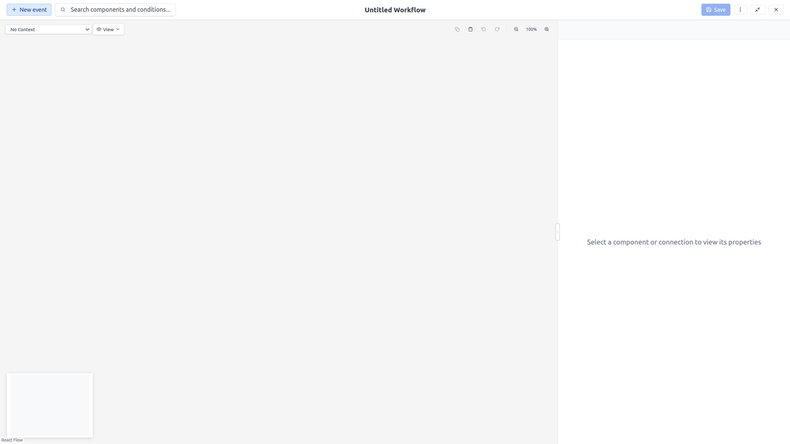
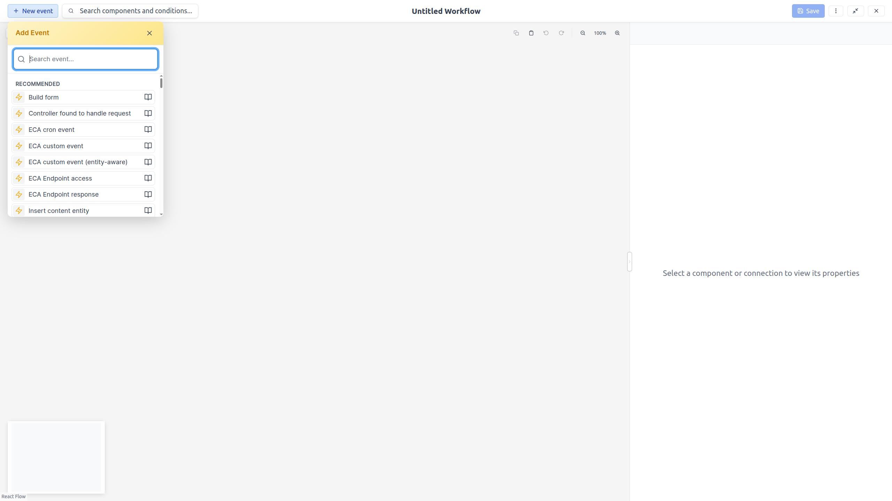

# Getting Started

## Installation

Install the Modeler module using Composer:

```bash
composer require drupal/modeler
```

Then enable the module:

```bash
drush en modeler
```

!!! note "Dependency"
    The Modeler module requires the **Modeler API** module (`modeler_api ^1.1`).
    Composer will install it automatically.

## Prerequisites

The Modeler module does not work on its own -- it requires a **Model Owner**
module that defines what is being modeled. The most common model owner is
[ECA (Event-Condition-Action)](https://www.drupal.org/project/eca), which
lets you build automated workflows in Drupal.

To get started with ECA and the Modeler:

```bash
composer require drupal/eca
drush en eca modeler
```

## Opening the modeler

Once a model owner is installed, you can access the modeler through that
module's interface. For example, with ECA:

1. Navigate to **Administration > Configuration > Workflow > ECA** (or
   `/admin/config/workflow/eca`).
2. Click **Add ECA model** to create a new workflow, or click an existing model
   to edit it.
3. The modeler opens.

{ .screenshot }

## First workflow

Here is how to create a simple workflow:

### 1. Add an event

Click the **+ Event** button in the toolbar. Select the event type -- for
example, "Entity insert" to trigger the workflow when content is created.

{ .screenshot }

### 2. Configure the event

When you select the event node, the **Property Panel** opens on the right.
Fill in the configuration form -- for example, choose which entity type should
trigger the event.

### 3. Add an action

Hover over the event node and click the **+** (quick-add) button that appears.
Select an action from the popup -- for example, "Send email". The action node
is placed automatically and connected to the event with an edge.

### 4. Add a condition (optional)

There are two ways to add a condition:

- **On the edge**: Hover over the edge between the event and the action. Click
  the **+** button that appears and select a condition.
- **Condition-first**: Alternatively, you can add a condition _before_ choosing
  the action. When using the node's **+** button, select a condition from the
  popup. This creates a placeholder node with the condition pre-attached -- you
  can then replace the placeholder with the real action.

Either way, the condition controls when the action fires -- for example,
"Entity is new".

### 5. Configure and save

Click each node to configure it in the Property Panel. When you are done, click
**Save** in the toolbar (or use the close button to save and return to the model
list).

## Next steps

- [Interface Overview](interface/index.md) -- understand the full layout
- [Working with Models](working-with-models/index.md) -- detailed editing guide
- [Keyboard Shortcuts](features/keyboard-shortcuts.md) -- work faster
