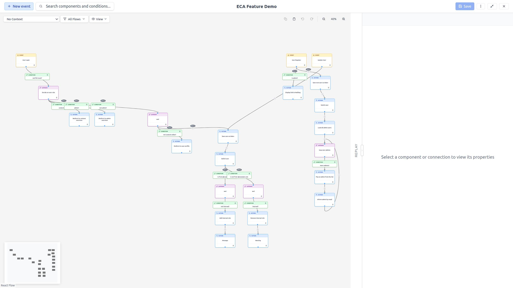
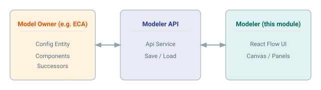

# Modeler for Drupal

The **Modeler** module provides a modern, React-based visual workflow editor for
Drupal. Built on [React Flow](https://reactflow.dev/), it offers a professional
visual interface for creating and editing workflow models -- complete with
real-time configuration, execution replay, live testing, and full keyboard
accessibility.

{ .screenshot }

## Who is this for?

This documentation is for **end users** -- site builders and administrators who
use the visual modeler to create and manage workflows in Drupal (for example,
ECA models). If you are a developer looking to build or extend the modeler
itself, see the [UI Development](development/index.md) section.

## Key features

| Feature | Description |
|---------|-------------|
| **Visual workflow editing** | Place nodes on a canvas using quick-add buttons, connect them with edges, and configure each component through dynamic forms. |
| **Execution replay** | Load past execution data, step through it visually on the canvas, and inspect token values at each step. |
| **Live testing** | Trigger a workflow execution from the modeler and see the results immediately. |
| **Quick-add** | Hover over a node to add a successor (action, gateway, or condition) with a type filter and context-aware filtering. Condition-first authoring lets you define conditions before choosing an action. Hover over an edge to add a condition. |
| **Undo/Redo** | Step back and forward through editing history with `Ctrl+Z` / `Ctrl+Shift+Z` or toolbar buttons. |
| **Keyboard shortcuts** | Full keyboard navigation: copy/paste, undo/redo, delete, search, and more. |
| **Dark mode** | Toggle between light and dark themes, persisted across sessions. |
| **Search** | Find nodes and edges by label, plugin, type, or ID with live highlighting. |
| **Flow filtering** | When multiple event flows exist, filter the canvas to show only the flows you need. |
| **Export** | Export models as Drupal recipes, archives, JSON (for the standalone viewer), or SVG images. |
| **Standalone viewer** | Embed a read-only workflow viewer in any web page -- no Drupal required. |
| **View modes** | Switch between fullscreen and floating-window mode; drag and resize the modeler window. |
| **Permissions** | Granular permission controls for editing metadata, templates, testing, and replay. |
| **Accessibility** | WCAG AA compliant with screen reader support, focus management, and respect for motion/contrast preferences. |

## Architecture at a glance

The Modeler module is a **plugin implementation** for the
[Modeler API](https://www.drupal.org/project/modeler_api) module. The Modeler
API defines the framework for visual modelers in Drupal, while this module
provides the actual React Flow-based editing experience.

## Requirements

- **Drupal** `^11.3 || ^12.0`
- **Modeler API** module (`modeler_api`) version `^1.1`

## Quick links

- [Getting Started](getting-started.md) -- installation and first steps
- [Interface Overview](interface/index.md) -- learn the panel layout
- [Working with Models](working-with-models/index.md) -- create, edit, and save workflows
- [Keyboard Shortcuts](features/keyboard-shortcuts.md) -- quick reference table
- [Replay & Testing](replay/index.md) -- visualize workflow executions

## Community

- [Issue queue](https://drupal.org/project/issues/modeler)
- [GitLab repository](https://git.drupalcode.org/project/modeler)
- [Slack channel](https://drupal.slack.com/archives/C08K6KX2EHH)
