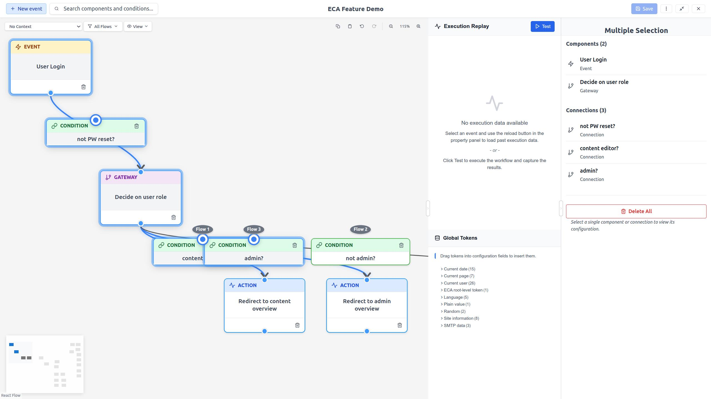

# Canvas

The **Canvas** is the central workspace of the modeler, powered by
[React Flow](https://reactflow.dev/). It is where you visually build and
arrange your workflow.

## Navigation

The modeler uses a **Figma-like gesture scheme** for canvas navigation. This
keeps the left mouse button free for selection while providing intuitive
panning and zooming with the scroll wheel and modifier keys.

### Panning

- **Mouse wheel / trackpad scroll**: Scroll in any direction to pan the
  canvas. This is the primary way to move around the workspace.
- **Middle-click drag** or **right-click drag**: Click and drag with the
  middle or right mouse button to pan.
- **Space + drag**: Hold Space and drag with the left mouse button to pan
  (hand tool).

The canvas is infinite in all directions.

### Zooming

- **Ctrl + Mouse wheel** (`Cmd + wheel` on Mac): Zoom in and out.
- **Pinch-to-zoom**: Use a trackpad pinch gesture to zoom.
- **Zoom controls**: Use the **+** and **-** buttons in the Canvas Toolbar.
- **Fit to screen**: Click the fit-to-screen button in the Canvas Toolbar to
  automatically zoom and pan so that all nodes are visible.

## Selecting elements

### Single selection

Click on a node or edge to select it. The Property Panel will open
automatically on the right.

### Multi-selection

- **Left-click + Drag** on the canvas background: Draw a selection rectangle to
  select multiple elements. Partially overlapped elements are included.
- **Shift + Click**: Add or remove individual elements from the selection.

When multiple elements are selected, the Property Panel shows a **Multi-Selection
Panel** with bulk operations (delete all).

{ .screenshot }

### Deselecting

Click on an empty area of the canvas to deselect all elements.

## Adding elements

There are two ways to add elements to the canvas:

### Quick-add buttons

Hover over a node to reveal a **+** button. Clicking it opens a popup where you
can choose a successor component (action, gateway, or condition). The popup
includes a collapsible **type filter** to narrow by component type. Selecting
an action or gateway creates and connects a new node. Selecting a condition
creates a [placeholder node](../components/nodes.md#placeholder-nodes) with the
condition pre-attached to the edge.

Similarly, hover over an edge to reveal a **+** button for adding a condition.

### Event button

Click the **+ Event** button in the toolbar to add a new event (start) node.
The canvas automatically pans to center the new node in the viewport.

## Connecting elements

To create an edge (connection) between two nodes:

1. Hover over the source node to reveal its **output port** (a small circle on
   the bottom or right of the node).
2. Click the output port and drag to the **input port** of the target node.
3. Release to create the connection.

## Node types

The canvas displays four visual node types:

| Node Type | Shape | Description |
|-----------|-------|-------------|
| **Event** (start) | Rounded | Triggers that start a workflow (e.g., "Entity insert"). |
| **Element** (action) | Rectangle | Actions that perform work (e.g., "Send email"). |
| **Gateway** | Diamond | Decision points that control flow branching. |
| **Subprocess** | Double-bordered rectangle | References to other workflow models. |
| **Placeholder** | Dashed amber rectangle | Temporary node awaiting action/gateway assignment. |

## Edge types

Edges can be:

- **Simple connections**: A direct link from one node to another.
- **Conditional edges**: Edges with a condition attached, shown with a label.

## Snap to grid

All nodes snap to a 20px grid for consistent alignment. This keeps workflows
looking clean and professional.

## Smart node positioning

When you add a node using quick-add or the event button, the canvas
**automatically pans** to center the new node in the viewport with a smooth
animation. The modeler also finds a free position that:

- Does not overlap with existing nodes.
- Stays within the boundaries of the current workflow flow.
- Shifts neighboring flows if needed to make room.

This means you rarely need to manually reposition nodes.
