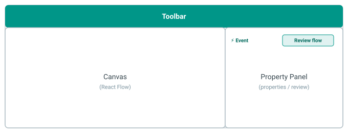
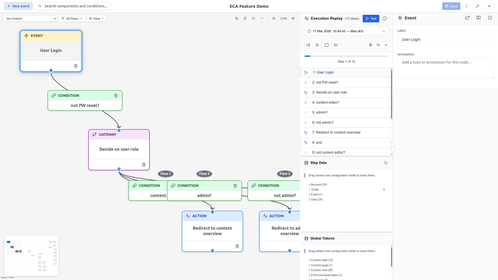

# Interface Overview

The Modeler uses a **three-panel layout** designed for efficient workflow editing.
Each panel has a specific role and they work together to provide a seamless
experience.

## Layout

{ .screenshot }

## The panels

### Canvas (center)

The **Canvas** is the main editing area where you build your workflow visually.
It is powered by React Flow and provides:

- **Node placement**: Use the toolbar or quick-add buttons to place components.
- **Edge connections**: Click an output port and drag to an input port to create connections.
- **Panning & zooming**: Scroll to pan; Ctrl+wheel to zoom (Figma-like gestures).
- **Selection**: Click to select, Shift+click for multi-select, drag on the background for box selection.
- **Snap to grid**: Nodes snap to a 20px grid for clean alignment.

[Learn more about the Canvas](canvas.md)

### Replay Panel (center-right)

The **Replay Panel** lets you visualize past workflow executions directly on the
canvas. It appears between the canvas and the property panel.

- **Load execution data**: Select an event node and load its execution history.
- **Step through**: Navigate execution steps one by one to see which path was taken.
- **Token inspection**: View the data (tokens) available at each step.
- **Live testing**: Trigger a test execution and see results immediately.

[Learn more about the Replay Panel](replay-panel.md)

### Property Panel (right)

The **Property Panel** appears automatically when you select a node or edge. It
provides:

- **Label editing**: Change the display name of any element.
- **Configuration form**: Dynamic form fields specific to the selected component.
- **Annotation**: Add a documentation note to any element.
- **Component info**: View metadata like plugin ID, provider, and documentation links.

[Learn more about the Property Panel](property-panel.md)

### Toolbars

The modeler has two toolbars that work together:

The **Main Toolbar** runs across the top and provides global actions:

- **Quick-add event**: Add a new event node.
- **Search**: Inline search bar (focus with `Ctrl+F`).
- **Model title**: Shows the model name with an unsaved-changes indicator.
- **Save**: Save the current model.
- **Kebab menu**: Access model settings, export, and dark mode.
- **View mode**: Toggle between fullscreen and restored display.

The **Canvas Toolbar** is a semi-transparent bar on the canvas surface:

- **Context selector**: Filter available components by workflow context.
- **Flow filter**: Show or hide individual flows when a model has multiple events.
- **View menu**: Fit view and auto layout.
- **Copy/Paste**: Clipboard operations for selected elements.
- **Undo/Redo**: Step back and forward through editing history.
- **Zoom controls**: Zoom in, zoom out, and see the current zoom level.

[Learn more about the Toolbars](toolbar.md)

## Panel resizing

The Property Panel can be resized by dragging its edge. This lets you adjust
the layout to focus on the canvas or on configuration, depending on your
current task.

## Responsive behavior

The modeler is designed to work in full-screen browser windows. For the best
experience, use a screen width of at least 1280px. Panels will adapt to
available space, and touch targets are sized for touch devices (minimum
44x44px).

The Main Toolbar adapts to the available screen width. See
[Toolbar](toolbar.md) for details on responsive behavior.

The modeler also supports [View Modes](../features/view-modes.md) -- you can
switch between fullscreen and a resizable floating window.
