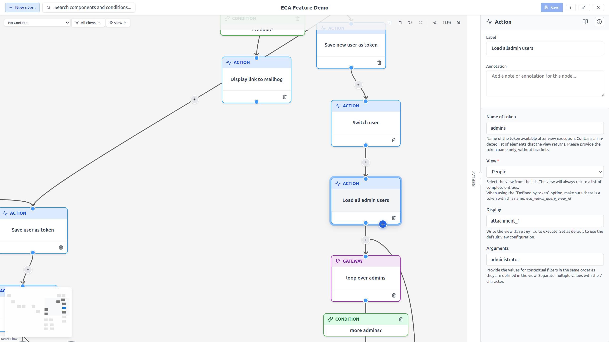
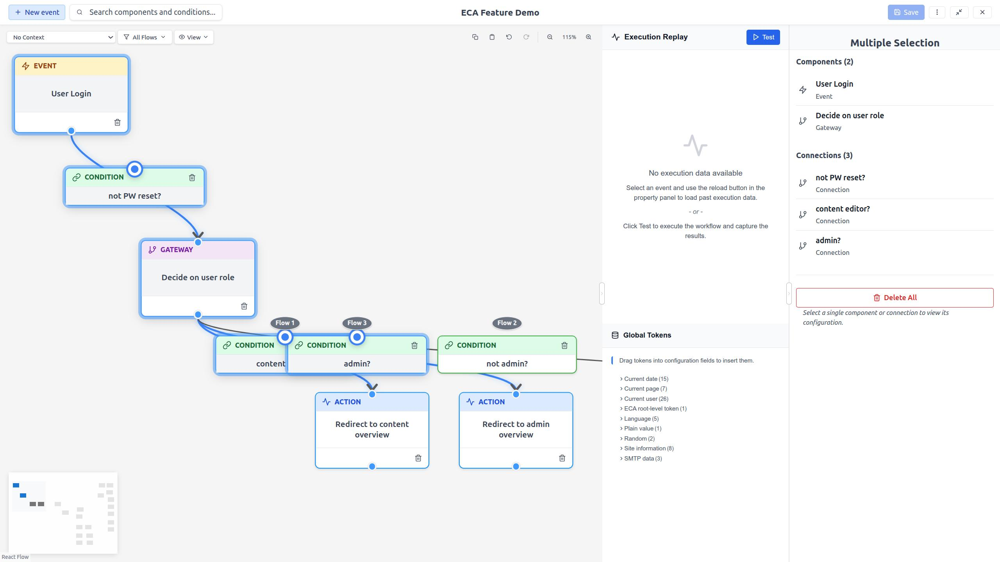

# Property Panel

The **Property Panel** appears on the right side of the modeler when you select
a node or edge. It provides all the tools needed to configure the selected
element.

{ .screenshot }

## Single element selection

When a single node or edge is selected, the Property Panel shows:

### Label

The display name of the element. Click the label to edit it inline.

### Configuration form

A dynamic form generated by the backend, specific to the selected component's
plugin. Form fields vary depending on the component type and may include:

- **Text fields**: For string values.
- **Select lists**: For choosing from predefined options.
- **Checkboxes**: For boolean settings.
- **Number fields**: For numeric values.
- **Text areas**: For multi-line text.

!!! tip "Token support"
    Some configuration fields accept **tokens** -- dynamic values from the
    workflow execution context. Fields that support tokens show a visual
    indicator during token drag operations. See
    [Replay & Testing > Tokens](../replay/tokens.md) for details.

### Annotation

An optional text note that documents what this element does.

### Info popup

Click the **i** button in the panel header to view metadata about the selected
element, including:

- Component ID
- Plugin ID
- Provider module
- Component type
- Documentation link (if available)

### Replay data

When replay data is available for the model, an event node's Property Panel
includes a **Load replay data** button. Clicking it fetches execution history
for that event. See [Replay & Testing](../replay/index.md) for details.

## Multi-selection

When multiple elements are selected (using Shift+click or box selection), the
Property Panel shows a **Multi-Selection Panel** with:

- **Selection summary**: Count of selected nodes and edges.
- **Delete all**: A danger-styled button that deletes all selected elements
  after a confirmation dialog.

{ .screenshot }

## Panel resizing

Drag the left edge of the Property Panel to resize it. This gives you more
space for long configuration forms.
