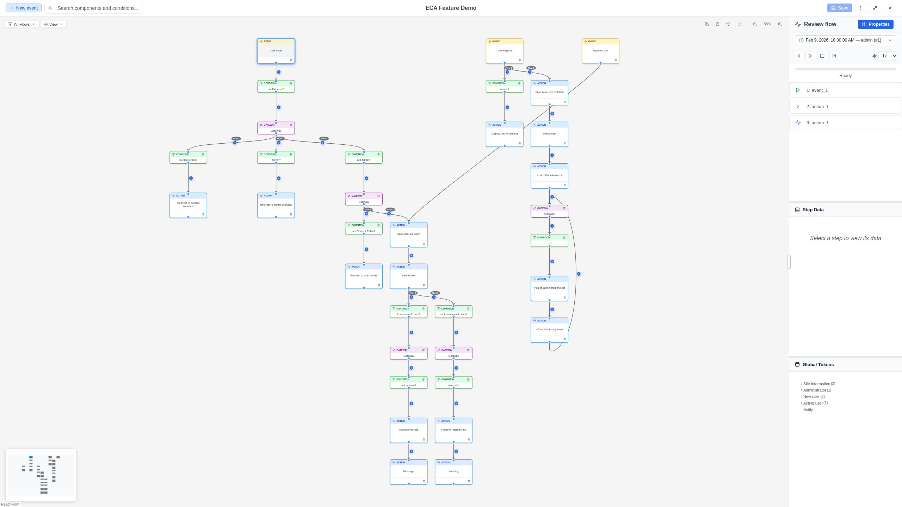

# Review flow mode

**Review flow** is one of the two coexisting views of the unified
[Property Panel](property-panel.md). Start it from a selected **event node** by
clicking the **Review flow** button in the panel header to visualize past
workflow executions and run live tests directly from the modeler -- all in the
same right-hand panel (there is no separate replay column). The Review header
uses the same layout as the Properties header: a **Review flow** context label
on the left and a **Properties** button on the right that switches back to the
selected component's properties (the replay session stays active).

{ .screenshot }

{ .screenshot }

## Availability

To **start** a session, the **Review flow** button appears for a selected
**event node** only when the model is **saved** and has replay or test
capabilities configured. For new (unsaved) models it is not shown, since there
is no execution history to display and testing requires a saved model --
clicking it with unsaved changes first prompts you to save (see
[Property Panel > Unsaved changes](property-panel.md#properties-and-review-flow-two-coexisting-views)).
Once a session is active, the **Review flow** button is available from **any**
selected component so you can return to the running replay.

## Starting a session

1. Select an **event node** on the canvas.
2. Click the **Review flow** button in the panel header.
3. The session opens for that event: the live listener starts and historical
   execution data loads automatically.

The session is **linked to that event** for its whole lifetime. Switching to the
Properties view and back never restarts the listener or reloads history.

If multiple executions exist, an **entry selector** dropdown lets you switch
between them. Each entry shows a timestamp and metadata about the execution.

## Navigating execution steps

Once replay data is loaded:

- **Step list**: Each execution step is listed with an icon indicating its type
  (started, execute, condition passed, condition failed).
- **Click a step**: The corresponding node or edge is highlighted on the canvas,
  and the Property Panel shows its configuration.
- **Forward/Back buttons**: Navigate sequentially through steps.

### Playback controls

- **Play**: Automatically steps through the execution at the selected speed.
- **Pause**: Stops auto-play at the current step.
- **Speed**: Choose 0.5x, 1x, or 2x playback speed.
- **Stop**: Exits replay mode entirely.

## Visual indicators

During replay, the canvas shows:

- **Highlighted nodes**: The current step's node is highlighted.
- **Edge indicators**: Circular indicators appear at edge midpoints:
  - Green with a checkmark for conditions that **passed**.
  - Red with an X for conditions that **failed**.

## Step data

When a step is selected, the panel shows the **Step Data** section with token
values available at that point in the execution. Token data is displayed in a
collapsible tree structure.

!!! tip "Insert tokens into forms"
    Type **`[`** in a token-supporting configuration field to browse and insert
    tokens from the Step Data, Global, and Template sources. See
    [Tokens & Data](../replay/tokens.md) for details.

## Global tokens

If the site provides global tokens (like `[site:name]` or
`[current-date:long]`), they appear in a **Global Tokens** section at the
bottom of Review flow mode. These are always visible, regardless of whether
replay data is loaded.

Global tokens can be inserted into configuration form fields with the `[`
picker.

## Template tokens

When the model is marked as a **template**, a **Template Tokens** section
appears alongside the global tokens. These tokens are specific to the
template's context and are provided by the backend. They behave the same as
global tokens -- always visible and insertable into configuration form fields
with the `[` picker.

See [Tokens & Data](../replay/tokens.md) for details on using tokens.

## Resizable sections

The Review flow sections (execution controls, step data, global tokens,
template tokens) are **vertically resizable**. Drag the horizontal separator
between any two sections to give more space to the section you need.

- **Minimum height**: Each section has a minimum height of 60 pixels.
- **Persistence**: Section proportions are saved to local storage and
  restored on the next visit.
- **Dynamic sections**: The number of sections adapts to context -- for
  example, template tokens only appear when the model is a template.

## Empty state message

When no execution data has been captured yet, Review flow mode shows a short
prompt — *"No execution data yet"* with the guidance *"Trigger the event on your
site and its execution will appear here automatically."* The live listener
starts when you enter Review, so once the event runs its execution appears here
without any further action. There is no separate reload or Test button.
