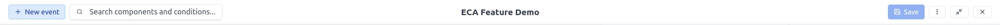

# Toolbar

The modeler has two toolbars: the **Main Toolbar** running along the top of the
modeler, and the **Canvas Toolbar** rendered directly on the canvas surface.
Together they provide all global actions and status information.

{ .screenshot }

## Main Toolbar

The Main Toolbar is organized into three sections: left, center, and right.

### Left section

#### Quick-add event button

The **+ Event** button lets you add a new event (start node) to the canvas.
Clicking it opens a popup with all available event types. Select one to place
it on the canvas.

#### Search bar

An inline search bar lets you search nodes and edges by label, plugin, type,
or ID. Type to filter; matching results appear in a dropdown and are
highlighted on the canvas. Press `Ctrl+F` / `Cmd+F` to focus the search bar.

See [Search & Find](../features/search.md) for details.

#### Plugin widgets (left)

Plugins registered with `position: 'left'` appear here, between the search
bar and the center section. See [Plugin API](../development/plugin-api.md).

### Center section

#### Model title

Displays the current model name. An unsaved-changes indicator (a dot) appears
next to the title when you have made changes that have not been saved yet.

Click the title to open the **Metadata Modal**, where you can edit the model's
name, description, version, tags, and other properties.

**Double-click** the title area to toggle between fullscreen and restored
[view modes](../features/view-modes.md).

In restored mode within Drupal, you can **drag** the center area to reposition
the modeler window.

#### Messages indicator

When the system has messages to display (e.g., save confirmations, warnings),
a lightning bolt icon appears next to the title. Click it to toggle message
visibility. A trash icon lets you clear all messages.

Messages auto-fade after 5 seconds, but you can pin them by clicking the
lightning bolt icon after they fade.

### Right section

#### Plugin widgets (right)

Plugins registered with `position: 'right'` appear first in the right section.
See [Plugin API](../development/plugin-api.md).

#### Save

Saves the current model. The button is disabled when there are no unsaved
changes.

#### Kebab menu

A three-dot menu button provides access to additional actions:

- **Model settings**: Opens the Metadata Modal (same as clicking the title).
- **Export**: Opens the export dialog (Recipe, Archive, JSON, or SVG).
  See [Export](../features/export.md).
- **Dark mode toggle**: Switches between light and dark themes.
  See [Dark Mode](../features/dark-mode.md).
- **Documentation**: Opens the project documentation site in a new browser tab.

#### View mode toggle

Switches between fullscreen and restored [view modes](../features/view-modes.md).

#### Close

Returns to the model list. If there are unsaved changes, a confirmation dialog
appears with options to **Save and Close**, **Close Without Saving**, or
**Cancel**.

## Canvas Toolbar

The Canvas Toolbar is a semi-transparent bar rendered at the top of the canvas
area. It provides context-aware controls organized into left and right groups.

### Left group

#### Context selector

When the model owner provides workflow contexts, a dropdown appears that lets
you filter the available components to those relevant to a specific context.
Selecting a context:

- Filters quick-add popups to show only relevant components.
- Applies dependency rules to further narrow available components.

#### Start flow filter

When the model has multiple event flows, a **flow filter** dropdown appears
that lets you show or hide individual flows on the canvas. This is useful for
focusing on a specific part of a complex workflow.

See [Flow Filtering](../features/flow-filtering.md) for details.

#### View menu

A dropdown menu with view-related actions:

- **Fit View**: Zooms and pans to fit all visible nodes into the viewport.
- **Auto Layout**: Automatically repositions all nodes using an optimized
  layout algorithm (hidden in read-only mode).

### Right group

#### Copy and Paste

- **Copy**: Copies the selected elements to the clipboard (also available via `Ctrl+C`).
- **Paste**: Pastes copied elements onto the canvas (also available via `Ctrl+V`).

These buttons are enabled/disabled based on the current selection and clipboard
state. Hidden in read-only mode.

#### Undo and Redo

- **Undo** (`Ctrl+Z` / `Cmd+Z`): Reverts the last action (add/delete/move node, connection, etc.).
- **Redo** (`Ctrl+Shift+Z` / `Cmd+Shift+Z` or `Ctrl+Y` / `Cmd+Y`): Re-applies a previously undone action.

The history stores up to 50 actions, allowing you to undo multiple changes. Both buttons
are disabled when there is no history to undo or redo. Hidden in read-only mode.

#### Zoom controls

- **Zoom out** (-): Decrease the zoom level.
- **Zoom percentage**: Displays the current zoom level.
- **Zoom in** (+): Increase the zoom level.

Both buttons are disabled when reaching the zoom limits.

## Responsive behavior

The Main Toolbar adapts to the available screen width. The most important
actions (Save, Close, View mode) remain visible at all times, while the kebab
menu keeps secondary actions accessible without cluttering the toolbar.

The Canvas Toolbar maintains a compact layout that does not interfere with
canvas interaction. Its buttons use small icon-only styling and are rendered
on a semi-transparent background.
