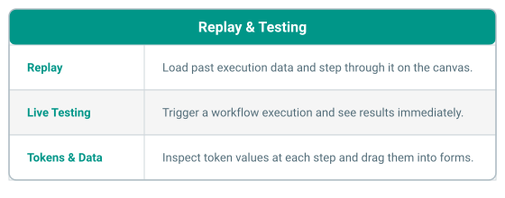

# Replay & Testing

The Modeler lets you visualize past workflow executions and run live tests
directly from the editing interface. This helps you understand how your
workflow behaves and debug issues without leaving the modeler.

## Overview

## Availability

Replay and testing features are only available when the model owner has
configured the necessary backend endpoints:

| Feature | Required endpoint | Description |
|---------|-------------------|-------------|
| **Replay** | `replay_url` | Loads past execution data for an event. |
| **Testing** | `test_url` | Triggers a live test execution. |

If neither endpoint is configured, the Replay Panel is hidden entirely.

For **new models** that have not been saved yet, both features are unavailable
-- you must save the model first.

## Sections

- [Viewing Replay Data](viewing.md) -- load and navigate past executions
- [Live Testing](testing.md) -- trigger and observe test executions
- [Tokens & Data](tokens.md) -- inspect and use token values from executions
