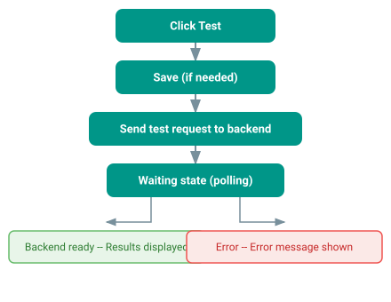
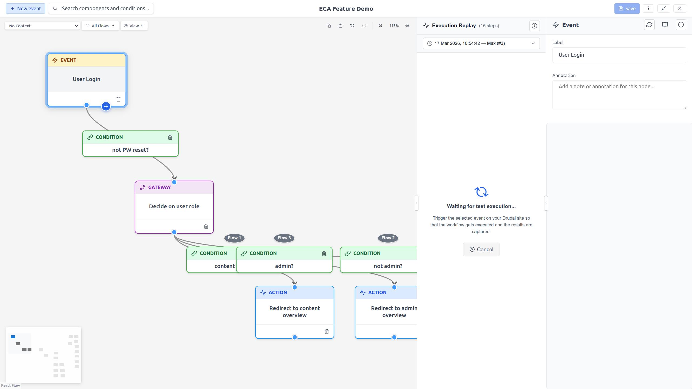

# Live Testing

Live testing lets you trigger a workflow execution directly from the modeler
and see the results immediately, without leaving the editing interface.

## Prerequisites

- The model owner must have configured a **test endpoint** (`test_url`).
- The model must be **saved** (new unsaved models cannot be tested).
- The model must not contain any **placeholder nodes** (temporary nodes with
  dashed amber borders that have not been assigned a real action or gateway).
- An **event node** must be selected on the canvas.

## Starting a test

1. **Select an event node** on the canvas.
2. Click the **Test** button (play icon) in the Replay Panel header.

### Unsaved changes

If you have unsaved changes when clicking Test, a confirmation dialog appears:

- **Save and test**: Saves the model first, then starts the test.
- **Cancel**: Returns to editing without testing.

The save happens automatically before the test begins, ensuring the backend
tests the latest version of your model.

!!! note
    If the model contains placeholder nodes, saving is blocked and the test
    cannot proceed. Replace all placeholders with real actions or gateways first.

## Test execution flow

## Waiting state

While the test is in progress, the Replay Panel shows:

- A **spinning icon** indicating the test is running.
- A **phase-aware message**:
  - "Starting test..." during initial request.
  - "Waiting for test execution..." during polling.
- **Instructions**: "Trigger the selected event on your Drupal site so that
  the workflow gets executed and the results are captured."
- A **Cancel** button to abort the test (shown during the polling phase).

{ .screenshot }

!!! note "Manual triggering"
    Depending on the event type, you may need to manually trigger the event on
    your Drupal site. For example, if the event is "Entity is created", you
    need to create a piece of content in another browser tab. The modeler polls
    the backend until the execution is captured.

## Viewing results

When the test completes successfully, the results are loaded into the Replay
Panel as execution steps. You can then:

- **Step through** the execution to see what happened.
- **Inspect token values** at each step.
- **See condition results** on edges (green/red indicators).

The test result appears as a single execution entry, so the entry selector
dropdown is not shown.

## Error handling

If the test fails, an error message is displayed in the toolbar's message area.
Common errors include:

- Backend configuration issues.
- Permission problems.
- Timeout (the event was not triggered within the polling period).

## Canceling a test

Click the **Cancel** button in the waiting state to abort a running test. This
stops the polling and returns the Replay Panel to its normal state.
