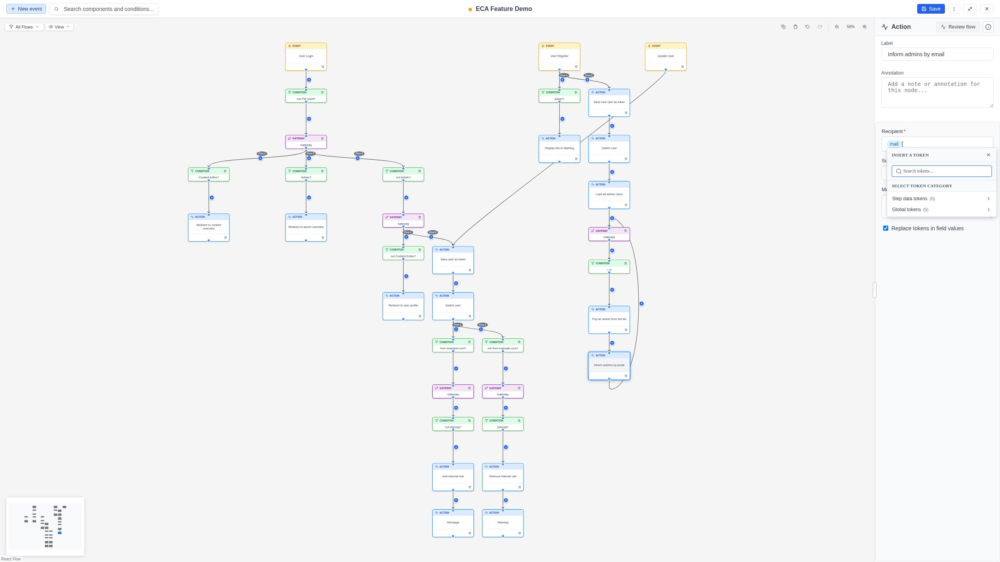

# Tokens & Data

During workflow execution, components produce and consume **tokens** -- named
values that carry data through the workflow (e.g., the title of a content item,
the current user's email, a computed value). The modeler lets you inspect these
tokens and use them in configuration forms.

## Viewing token data

### Step data

When you select a replay step in **Review flow** mode, the step expands and the
token values available at that point in the execution are rendered **inline
underneath that step row**.

Token data is displayed as a **collapsible tree**:

- **Top-level entries**: Token names with their current values.
- **Nested entries**: Complex tokens that contain child tokens (e.g., an entity
  token with properties like title, status, author).
- **Values**: The resolved value at the time of execution.

{ .screenshot }

### Global and template tokens

Site-wide tokens that do not depend on the workflow execution - such as
`[site:name]`, `[current-date:long]` or `[current-user:name]` - are not listed
in Review flow mode. Neither are the extra tokens that a model marked as a
**template** provides. Both sets appear only in the `[` token picker, under its
**Global tokens** and **Template tokens** categories, so they are offered
exactly where you insert them.

## Inserting tokens with the `[` picker

The quickest way to insert a token is to **type `[`** directly inside a
token-supporting configuration field. A categorized picker opens at the cursor:

1. Place the cursor in a token-supporting field and type **`[`**.
2. Choose a category -- **Step data tokens**, **Global tokens**, or
   **Template tokens** (categories with a count are shown when available).
3. Drill into a category to browse its (possibly nested) tokens.
4. Click **Use →** on a token (or press **Enter**) to insert it as a token
   pill at the `[` position.

To narrow the list, type in the **Search tokens** box at the top of the picker;
it filters the tokens by label or token string across every category. Press
**Escape** to close the picker -- focus and the cursor return to the field where
you left off.

{ .screenshot }

!!! tip "Review the flow for richer tokens"
    When no step data is cached yet, the picker still offers Global and Template
    tokens and nudges you to **Review the flow** -- entering Review flow mode
    captures step-data tokens specific to your workflow's execution.

The picker is fully keyboard navigable (arrow keys to move, Enter to use,
Escape to close) and the active option is announced to assistive technology.

### Which fields accept tokens

Whether a field accepts tokens depends on two things:

1. **Per-field setting**: The component's developer marks specific fields as
   token-enabled.
2. **Replace tokens checkbox**: If the form includes a "Replace tokens"
   checkbox and it is enabled, **all** fields accept tokens.

## Editing tokens in fields

After a token is placed in a field, it appears as a styled pill. You can:

### Edit a token

- **Hover** over the token and click the **pencil icon** that appears.
- Or place your cursor next to the token and press `Ctrl+E` (`Cmd+E` on Mac).
- An inline editor opens where you can modify the token path.
- Press **Enter** or click **Save** to apply changes.
- Press **Escape** or click **Cancel** to discard changes.

### Move a token

Drag a token pill within the same field to reposition it. The token is removed
from its original position and inserted at the drop location.

### Remove a token

Select the token pill and press **Delete** or **Backspace** to remove it.

## Tips

- Use tokens to make your workflows dynamic -- avoid hardcoding values that
  may change.
- Global tokens are useful for site-wide values like the site name or current
  date.
- Step data tokens are specific to the execution context -- they show exactly
  what values were available at each step.
