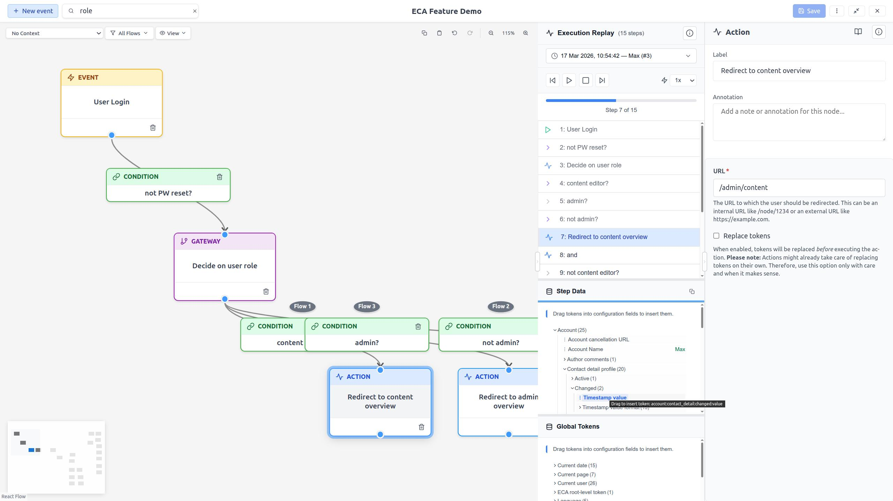

# Tokens & Data

During workflow execution, components produce and consume **tokens** -- named
values that carry data through the workflow (e.g., the title of a content item,
the current user's email, a computed value). The modeler lets you inspect these
tokens and use them in configuration forms.

## Viewing token data

### Step data

When you select a replay step in the Replay Panel, the **Step Data** section
expands to show the token values available at that point in the execution.

Token data is displayed as a **collapsible tree**:

- **Top-level entries**: Token names with their current values.
- **Nested entries**: Complex tokens that contain child tokens (e.g., an entity
  token with properties like title, status, author).
- **Values**: The resolved value at the time of execution.

{ .screenshot }

### Global tokens

The **Global Tokens** section appears at the bottom of the Replay Panel and
shows site-wide tokens that are always available, regardless of the workflow
execution context. Examples include:

- `[site:name]` -- the site name.
- `[current-date:long]` -- the current date.
- `[current-user:name]` -- the logged-in user's name.

Global tokens are always visible, even when no replay data is loaded.

### Template tokens

When the model is marked as a **template**, an additional set of
**template tokens** appears alongside the global tokens. These are tokens
specific to the template's context and are provided by the backend.

Template tokens work exactly like global tokens -- they are always visible in
the Replay Panel, can be expanded to view nested properties, and can be
dragged into configuration form fields.

## Dragging tokens into forms

You can drag tokens directly from the Replay Panel into configuration form
fields. This is the recommended way to insert token references.

### How to drag a token

1. **Load replay data** or **run a test** so tokens are visible in the Step
   Data section.
2. Look for the **grip icon** (vertical dots) next to a token label -- this
   indicates the token is draggable.
3. **Click and drag** the token from the Replay Panel to a configuration form
   field in the Property Panel.
4. **Drop** the token into the field. It appears as a styled **token pill**
   (e.g., `[node:title]`).

A help text hint ("Drag tokens into configuration fields to insert them.")
appears above the token data to guide you.

### Visual feedback during drag

While dragging a token:

- **Eligible fields** glow with a border highlight, indicating they accept
  the token.
- **Non-eligible fields** dim, indicating they do not accept tokens.
- **Label and Annotation fields** are always disabled for token drops.

### Which fields accept tokens

Whether a field accepts tokens depends on two things:

1. **Per-field setting**: The component's developer marks specific fields as
   token-enabled.
2. **Replace tokens checkbox**: If the form includes a "Replace tokens"
   checkbox and it is enabled, **all** fields accept token drops.

## Editing tokens in fields

After a token is placed in a field, it appears as a styled pill. You can:

### Edit a token

- **Hover** over the token and click the **pencil icon** that appears.
- Or place your cursor next to the token and press `Ctrl+E` (`Cmd+E` on Mac).
- An inline editor opens where you can modify the token path.
- Press **Enter** or click **Save** to apply changes.
- Press **Escape** or click **Cancel** to discard changes.

### Move a token

Drag a token pill within the same field to reposition it. The token is removed
from its original position and inserted at the drop location.

### Remove a token

Select the token pill and press **Delete** or **Backspace** to remove it.

## Tips

- Use tokens to make your workflows dynamic -- avoid hardcoding values that
  may change.
- Global tokens are useful for site-wide values like the site name or current
  date.
- Step data tokens are specific to the execution context -- they show exactly
  what values were available at each step.
