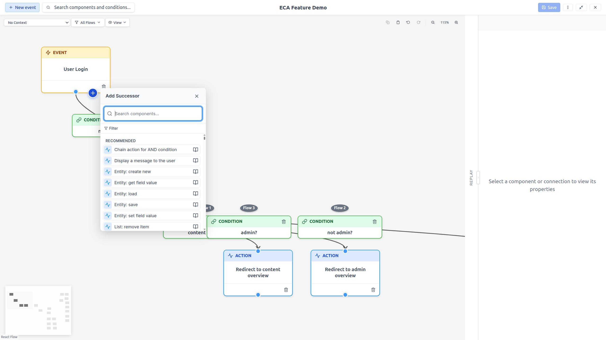

# Editing a Model

## Adding components

### Quick-add (recommended)

The fastest way to build a workflow is using **quick-add buttons**:

- **Node quick-add**: Hover over any node to reveal a **+** button. Click it to
  open a popup with available successor components -- actions, gateways, and
  conditions. Select an action or gateway, and the new node is placed and
  connected automatically. Select a condition for **condition-first authoring**
  (see below).

- **Condition quick-add**: Hover over any edge to reveal a **+** button. Click
  it to add a condition to that edge.

- **Event quick-add**: Click the **+ Event** button in the toolbar to add a new
  event (start) node.

{ .screenshot }

!!! note "Context-aware filtering"
    Quick-add popups only show components that are valid in the current context.
    If a workflow context is selected, only components defined for that context
    appear. Additionally, dependency rules may hide components that require
    specific predecessor types not present in the workflow.

#### Type filter

The node quick-add popup includes a collapsible **Filter** panel. Click the
"Filter" toggle to expand it and narrow the component list by type (All,
Actions, Conditions, or Gateways). A badge on the toggle indicates when a
filter is active.

#### Condition-first authoring

If you want to define a condition **before** choosing the successor action,
select a condition from the node quick-add popup. This creates:

1. A **placeholder node** (with a dashed amber border and a pulsing
   "Select action..." button).
2. A **condition edge** from the source to the placeholder, with the
   condition pre-attached.

The condition edge is automatically selected so you can configure it
immediately in the Property Panel.

!!! warning "Placeholder nodes must be resolved"
    A model containing placeholder nodes cannot be saved, tested, or closed.
    Click the "Select action..." button on the placeholder to replace it with a
    real action or gateway.

### Connecting nodes

To connect two nodes:

1. Hover over the source node to reveal its output port (a circle).
2. Click and drag from the output port to the target node's input port.
3. Release to create the edge.

## Configuring components

Click any node or edge to select it. The Property Panel opens on the right with:

### Label

The display label shown on the canvas. Click it to edit it inline. The label
is also editable directly on the canvas by double-clicking the node.

### Configuration form

A dynamic form with fields specific to the selected component's plugin. Common
field types include text fields, select lists, checkboxes, numbers, and text
areas.

!!! tip "Token fields"
    Some fields accept **tokens** (dynamic values). During a token drag from
    the Replay Panel, eligible fields glow to indicate they accept drops, while
    non-eligible fields dim. See [Tokens & Data](../replay/tokens.md).

## Moving and arranging

### Dragging nodes

Click and drag any node to reposition it on the canvas. Nodes snap to a 20px
grid.

### Auto-positioning

When adding nodes via quick-add, the modeler automatically finds an optimal
position that avoids overlapping existing nodes and respects flow boundaries.

## Selecting multiple elements

- **Left-click + Drag** on the canvas background: Draw a selection rectangle to
  select all elements within it (partially overlapped elements are included).
- **Shift + Click**: Add or remove individual elements from the selection.

The multi-selection panel lets you:

- **Delete all** selected elements (with confirmation).

## Deleting elements

- **Single element**: Select it and press `Delete`, or use the delete option
  in the Property Panel.
- **Multiple elements**: Select them and press `Delete`, or use the
  "Delete All" button in the Multi-Selection Panel.

Deletions of multiple elements always require **confirmation** through a
dialog.

## Copy and paste

- **Copy**: Select elements and press `Ctrl+C` (or `Cmd+C` on Mac).
- **Paste**: Press `Ctrl+V` (or `Cmd+V` on Mac) to paste copied elements.

Pasted elements are offset from the originals so they don't overlap.

## Undo and Redo

The modeler supports full undo and redo:

- **Undo** (`Ctrl+Z` / `Cmd+Z`): Reverts the last action -- adding, deleting,
  or moving nodes, creating connections, and other changes.
- **Redo** (`Ctrl+Shift+Z` / `Cmd+Shift+Z` or `Ctrl+Y` / `Cmd+Y`): Re-applies
  a previously undone action.

The history stores up to **50 snapshots**, so you can step back through many
changes. Undo and Redo buttons are also available in the
[Canvas Toolbar](../interface/toolbar.md#canvas-toolbar).
