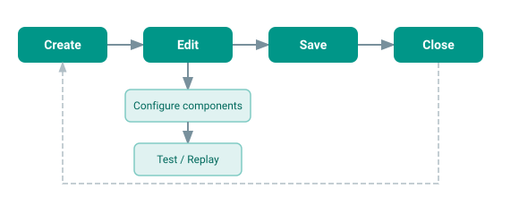

# Working with Models

This section covers the full lifecycle of a workflow model -- from creating a
new one to editing, saving, and closing it.

## Model lifecycle

## What is a model?

A model is a visual representation of a workflow. It consists of:

- **Nodes**: The building blocks of your workflow (events, actions, gateways,
  subprocesses).
- **Edges**: Connections between nodes, optionally with conditions.
- **Metadata**: Name, description, version, tags, and other properties.
- **Annotations**: Optional notes attached to nodes or edges.

The model is stored as a JSON document and converted to the model owner's
internal format (e.g., ECA configuration entities) when saved.

## Sections

- [Creating a Model](creating.md) -- start a new workflow from scratch
- [Editing a Model](editing.md) -- add, configure, and connect components
- [Saving & Closing](saving.md) -- persist your work and return to the list
