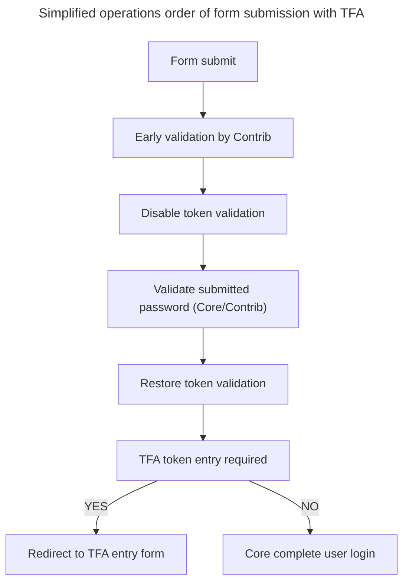

# TFA altering of login forms

## Overview

TFA alters the ```user_login_form``` and ```user_login_block``` forms to provide the interfaces for token validation.

Actions taken include:
* Disable TFA validation in ```user.auth``` service decorator to allow password validation without token.
* Redirect the user to the TfaEntryForm if necessary.

## Order of operations:



Login flow is is not significantly altered.

TFA injects Form API validation callbacks at the beginning and end of the validation stage (as it exists at the time of TFA form alter hook execution) to allow the User Login form and all other modules to validate the submitted username without requiring a token.

TFA injects a submit form handler at the beginning of the form submission (as it exists at time of TFA form alter hook execution) to unset the ```uid``` property from ```$form_state``` if the user requires a redirect to the TFA entry form and prevent ```UserLoginForm::submitForm``` from finalizing the user login. A second submit handler is placed at the end of the submission callback stack to set the redirect.

All of the above is protected by the ```TfaUserSetSubscriber``` event subscriber.

## Technical limitations impacting compatibility

### Early/Late validation password validation
Validation of passwords performed before ```TfaLoginFormHelper::tfaLoginFormPreValidation()``` or after ```TfaLoginFormHelper::tfaLoginFormPostValidation()``` on users with TFA enabled will, similar to REST authentication, be required to provide the token as part of the password for validation to be successful. Users without TFA or with TFA providing a token will be allowed to validate and TFA checks record as completed.

### Disabling token validation requires username
```TfaLoginFormHelper::tfaLoginFormPreValidation()``` provides the callback to disables token validation requires a username to be present in the ```name``` field of the form. ['#3497020 Implement Drupal\user\UserAuthenticationInterface'](https://www.drupal.org/project/tfa/issues/3497020) is anticipated to resolve this concern.

### The $form_state UID property required to be set
TFA expects that any modules altering the login form will continue to utilize the core method of populating the ```$form_state``` with the UID of an account upon successful validation.
