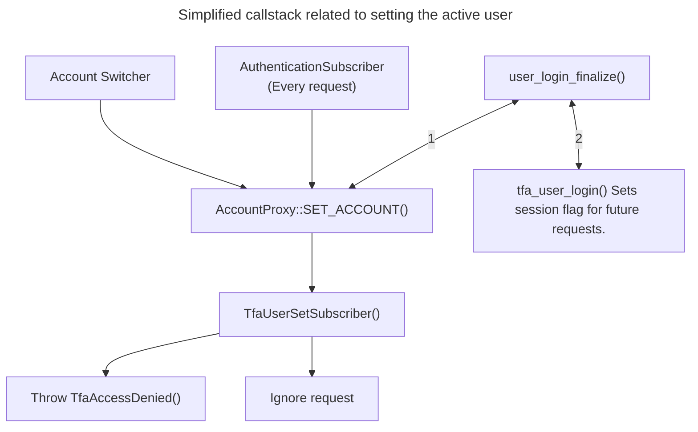
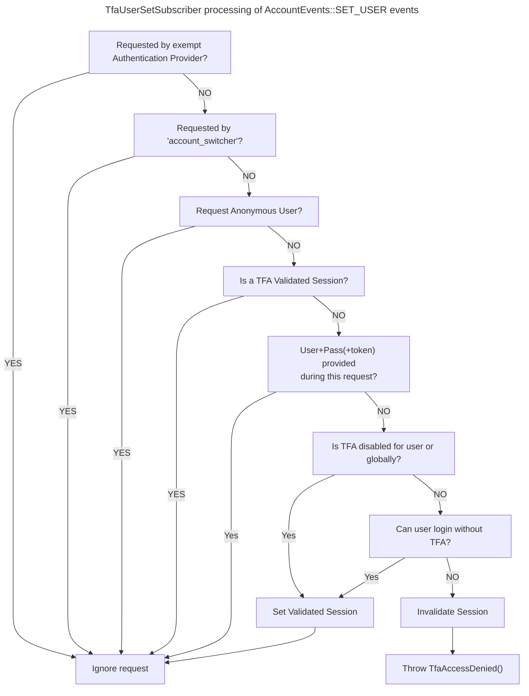

# AccountEvents::SET_USER event protection
The ```AccountEvents::SET_USER``` event is dispatched by
```\Drupal\Core\Session\AccountProxy::SET_ACCOUNT()``` (the Drupal
```current_user``` service) upon each call.

## Common triggers for the event

This event is usually dispatched as a result of:

* A new request processing through the ```AuthenticationSubscriber```.
* Session login completed by ```user_login_finalize()```.
* A call to the ```account_switcher``` service.

## Simplified callstack related to AccountEvents::SET_USER



## TfaUserSetSubscriber() processing of events



### General operation
The ```TfaUserSetSubscriber::rejectUserIfTfaBypassed()``` subscriber checks
various 'flags' that have been set by:

* ```TfaAccountSwitcher::switchTo()``` and
  ```TfaAccountSwitcher::switchBack()``` (```account_switcher``` service)
* ```TfaAuthDecorator::authenticate()``` and
  ```TfaChallengeAuthDecorator::authenticate()``` (```auth_provider```
  decorator)
* ```tfa_user_login()``` (implements ```hook_user_login()```)

The majority of these 'flags' are set in a Memory Cache ('tfa_memcache')
which is not retained across requests.

It is considered security critical that the 'tfa_memcache' bin utilize only
non-persistent storage.

### Request by exempt Authentication Provider
Authentication providers are responsible for authenticating user requests.

Authentication methods that do not authenticate through the ```user.auth```
service may not receive a 'flag' indicating the user has completed TFA
Authentication.

Traditionally token-like authentication is intended to allow programmatic
access to a site. TFA allows configuring the
```tfa.auth_provider_bypass``` service parameter to selectively allow these
providers to bypass TFA.

Exempted authentication providers are decorated by
```TTfaAuthDecorator::class```  or ```TfaChallengeAuthDecorator::class```
depending upon if the class implements AuthenticationProviderInterface or
AuthenticationProviderInterface&AuthenticationProviderChallengeInterface.

If an authentication provider implements more than these two interface
combinations a custom decorator will need to be provided.

Drupal Core contains two authentication providers:

* cookie: Used for session authentication, enabled on most sites. This method
  does not call the ```user.auth``` service, instead using a session cookie,
  however ```tfa_user_login()``` sets the appropriate flag during login.
* basic_auth: Provides support for HTTP Basic authentication. This method
  calls the ```user.auth``` service on each request allowing validation that TFA
  authentication has been completed.

Both of these authentication methods are supported by TFA and may not be
exempted.

### Request by Account Switcher service
The ```account_switcher``` service is used to temporarily (limited to the
single request) change the user Drupal will process actions as.

To prevent a breach of the Drupal API all Account Switcher requests are
permitted.

### Set Anonymous user
The Anonymous user is used extensively throughout Drupal for non-privileged
access. The anonymous user inherently does not have any authentication
credentials.

All requests for the Anonymous user will be permitted.

### Session contains a TFA complete record
Session (cookie) authentication by its nature does not submit the credentials
on each request and instead relies on a session record being present which
indicates the UID of the user.

To ensure that a user completed TFA authentication through either the
```user.auth``` service or the TFA Login forms an additional parameter is added
to the user session by ```tfa_user_login()``` when called by
```user_login_finalize()```. This additional parameter allows persistent
validation  that an authenticated user processed through TFA to prevent
accidental login from 3rd party modules either calling or setting a UID in the
request session.

### The 'user.auth' service grants access
The ```user.auth``` service is decorated by the ```TfaUserAuth``` class. Login
attempts  are checked to determine if a TFA Token is required, and if so that
the token is present and valid. The ```TfaUserAuth``` class will set a 'flag'
in the Memory Cache indicating that the authentication credentials submitted
have been processed by TFA and, if required, a valid token was present or a
login plugin approved the authentication request.

The 'http_basic' auth provider is protected by this feature of TFA.

### Fail secure
The EventSubscriber is intended to fail secure.  Each of the exemption methods
checks that the UID of the account being set is the same as the UID that
validated through the checkpoints.

Should none of the check match exactly the default response is to throw a
TfaAccessDenied exception that will be caught through the normal Core stack.

:warning: This security depends on no additional code being added to a site
that intentionally bypass or remove these checks.

Any external modules overriding any of these security checks is responsible
for the security implications of doing so.

Any overrides to the ```AccountEvents::SET_USER``` event should be done in a
manner that event propagation is only stopped on failure.
